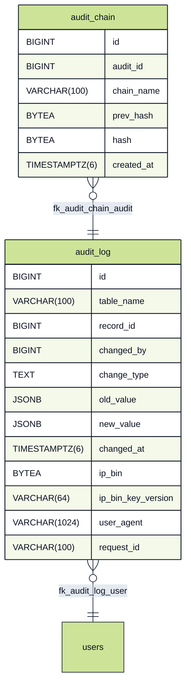

```mermaid
%%{init: {"theme":"forest","themeVariables":{"primaryColor":"#e5e7eb","primaryBorderColor":"#111827","primaryTextColor":"#0b1021","edgeLabelBackground":"#f8fafc","tertiaryColor":"#cbd5e1","tertiaryTextColor":"#0f172a","lineColor":"#0f172a","nodeBorder":"#111827","textColor":"#0b1021","fontSize":"14px"}} }%%
%% Detail ERD for audit_chain (engine: postgres, neighbors: 1)
erDiagram
  direction TB
  audit_chain {
    BIGINT id
    BIGINT audit_id
    VARCHAR(100) chain_name
    BYTEA prev_hash
    BYTEA hash
    TIMESTAMPTZ(6) created_at
  }
  audit_log {
    BIGINT id
    VARCHAR(100) table_name
    BIGINT record_id
    BIGINT changed_by
    TEXT change_type
    JSONB old_value
    JSONB new_value
    TIMESTAMPTZ(6) changed_at
    BYTEA ip_bin
    VARCHAR(64) ip_bin_key_version
    VARCHAR(1024) user_agent
    VARCHAR(100) request_id
  }
audit_chain }o--|| audit_log : fk_audit_chain_audit
audit_log }o--|| users : fk_audit_log_user
```
