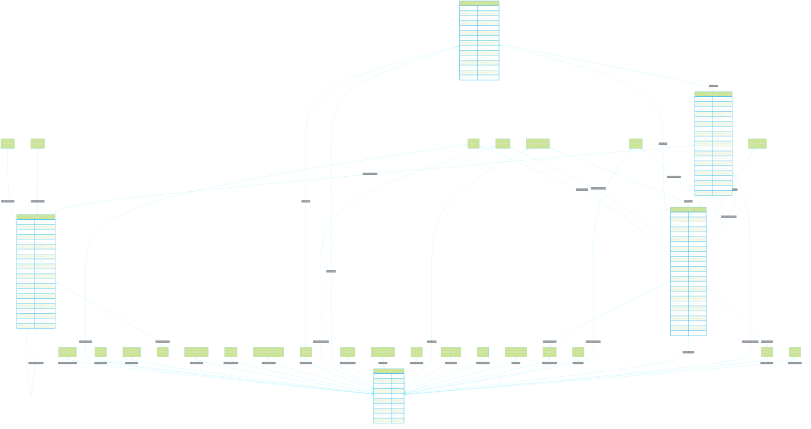

```mermaid
%%{init: {"theme":"forest","themeVariables":{"primaryColor":"#0b1021","primaryBorderColor":"#4ade80","primaryTextColor":"#e2e8f0","edgeLabelBackground":"#0b1021","tertiaryColor":"#111827","tertiaryTextColor":"#cbd5e1","lineColor":"#67e8f9","nodeBorder":"#38bdf8","textColor":"#e2e8f0"}} }%%
%% Detail ERD for book_assets (engine: postgres, neighbors: 4)
erDiagram
  %% direction: TB
  book_assets {
    BIGINT id
    BIGINT tenant_id
    BIGINT book_id
    TEXT asset_type
    VARCHAR(255) filename
    VARCHAR(100) mime_type
    BIGINT size_bytes
    TEXT storage_path
    VARCHAR(64) content_hash
    VARCHAR(255) download_filename
    BOOLEAN is_encrypted
    VARCHAR(50) encryption_algo
    BYTEA encryption_key_enc
    BYTEA encryption_iv
    BYTEA encryption_tag
    BYTEA encryption_aad
    JSONB encryption_meta
    VARCHAR(64) key_version
    BIGINT key_id
    TIMESTAMPTZ(6) created_at
  }
  books {
    BIGINT id
    BIGINT tenant_id
    VARCHAR(255) title
    VARCHAR(255) slug
    TEXT slug_ci
    VARCHAR(512) short_description
    TEXT full_description
    NUMERIC(12) price
    CHAR(3) currency
    BIGINT author_id
    BIGINT main_category_id
    VARCHAR(32) isbn
    CHAR(5) language
    INTEGER pages
    VARCHAR(255) publisher
    DATE published_at
    VARCHAR(64) sku
    BOOLEAN is_active
    BOOLEAN is_available
    INTEGER stock_quantity
    TIMESTAMPTZ(6) created_at
    TIMESTAMPTZ(6) updated_at
    INTEGER version
    TIMESTAMPTZ(6) deleted_at
    BOOLEAN is_live
  }
  crypto_keys {
    BIGINT id
    VARCHAR(100) basename
    INTEGER version
    VARCHAR(255) filename
    VARCHAR(1024) file_path
    CHAR(64) fingerprint
    JSONB key_meta
    TEXT key_type
    VARCHAR(64) algorithm
    SMALLINT length_bits
    TEXT origin
    TEXT[] usage
    VARCHAR(100) scope
    TEXT status
    BOOLEAN is_backup_encrypted
    BYTEA backup_blob
    BIGINT created_by
    TIMESTAMPTZ(6) created_at
    TIMESTAMPTZ(6) activated_at
    TIMESTAMPTZ(6) retired_at
    BIGINT replaced_by
    TEXT notes
  }
  tenants {
    BIGINT id
    VARCHAR(200) name
    VARCHAR(200) slug
    TEXT slug_ci
    TEXT status
    TIMESTAMPTZ(6) created_at
    TIMESTAMPTZ(6) updated_at
    INTEGER version
    TIMESTAMPTZ(6) deleted_at
    BOOLEAN is_live
  }
  order_item_downloads {
    BIGINT id
    BIGINT tenant_id
    BIGINT order_id
    BIGINT book_id
    BIGINT asset_id
    BYTEA download_token_hash
    VARCHAR(64) token_key_version
    VARCHAR(64) key_version
    INTEGER max_uses
    INTEGER used
    BOOLEAN is_active
    TIMESTAMPTZ(6) expires_at
    TIMESTAMPTZ(6) last_used_at
    BYTEA ip_hash
    VARCHAR(64) ip_hash_key_version
  }
api_keys }o--|| tenants : fk_api_keys_tenant
authors }o--|| tenants : fk_authors_tenant
book_assets }o--|| books : fk_book_assets_book
book_assets }o--|| crypto_keys : fk_book_assets_key
book_assets }o--|| tenants : fk_book_assets_tenant
book_categories }o--|| books : fk_book_categories_book
books }o--|| authors : fk_books_author
books }o--|| categories : fk_books_category
books }o--|| tenants : fk_books_tenant
cart_items }o--|| books : fk_cart_items_book
cart_items }o--|| tenants : fk_cart_items_tenant
carts }o--|| tenants : fk_carts_tenant
categories }o--|| tenants : fk_categories_tenant
coupon_redemptions }o--|| tenants : fk_cr_tenant
coupons }o--|| tenants : fk_coupons_tenant
crypto_keys }o--|| crypto_keys : fk_keys_replaced_by
crypto_keys }o--|| users : fk_keys_created_by
idempotency_keys }o--|| tenants : fk_idemp_tenant
inventory_reservations }o--|| books : fk_res_book
inventory_reservations }o--|| tenants : fk_res_tenant
invoices }o--|| tenants : fk_invoices_tenant
key_events }o--|| crypto_keys : fk_key_events_key
key_usage }o--|| crypto_keys : fk_key_usage_key
newsletter_subscribers }o--|| tenants : fk_ns_tenant
notifications }o--|| tenants : fk_notifications_tenant
order_item_downloads }o--|| book_assets : fk_oid_asset
order_item_downloads }o--|| books : fk_oid_book
order_item_downloads }o--|| orders : fk_oid_order
order_item_downloads }o--|| tenants : fk_oid_tenant
order_items }o--|| books : fk_order_items_book
order_items }o--|| tenants : fk_order_items_tenant
orders }o--|| tenants : fk_orders_tenant
payment_gateway_notifications }o--|| tenants : fk_pg_notify_tenant
payments }o--|| tenants : fk_payments_tenant
rbac_user_permissions }o--|| tenants : fk_rbac_up_tenant
rbac_user_roles }o--|| tenants : fk_rbac_ur_tenant
refunds }o--|| tenants : fk_refunds_tenant
reviews }o--|| books : fk_reviews_book
reviews }o--|| tenants : fk_reviews_tenant
tenant_domains }o--|| tenants : fk_tenant_domains_tenant
```
