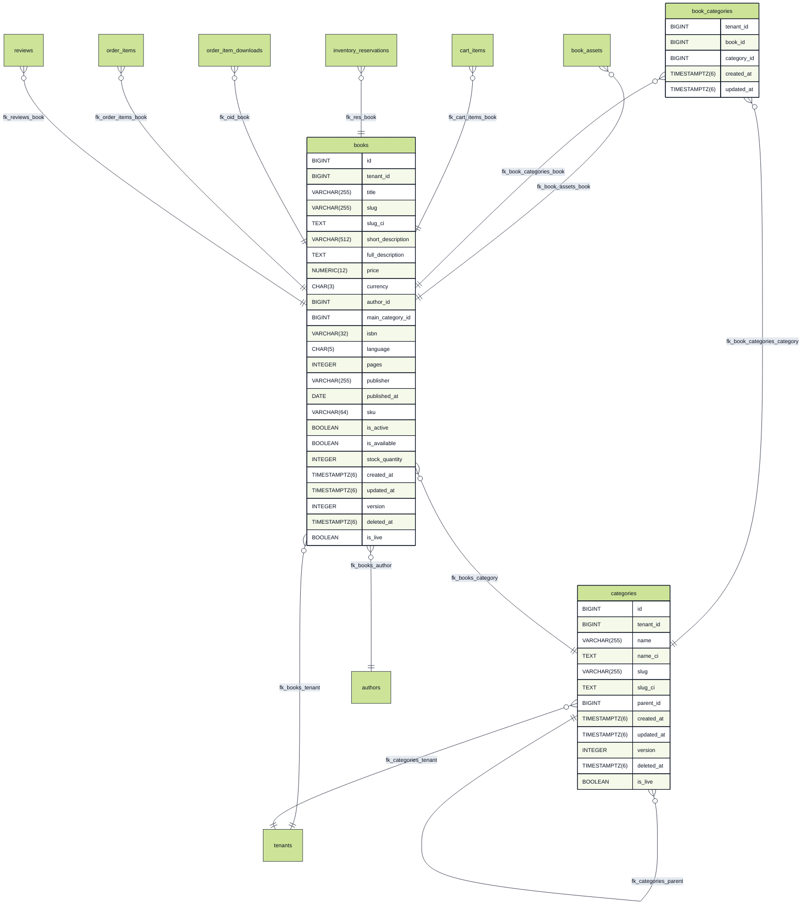

```mermaid
%%{init: {"theme":"forest","themeVariables":{"primaryColor":"#e5e7eb","primaryBorderColor":"#111827","primaryTextColor":"#0b1021","edgeLabelBackground":"#f8fafc","tertiaryColor":"#cbd5e1","tertiaryTextColor":"#0f172a","lineColor":"#0f172a","nodeBorder":"#111827","textColor":"#0b1021","fontSize":"14px"}} }%%
%% Detail ERD for book_categories (engine: postgres, neighbors: 2)
erDiagram
  direction TB
  book_categories {
    BIGINT tenant_id
    BIGINT book_id
    BIGINT category_id
    TIMESTAMPTZ(6) created_at
    TIMESTAMPTZ(6) updated_at
  }
  books {
    BIGINT id
    BIGINT tenant_id
    VARCHAR(255) title
    VARCHAR(255) slug
    TEXT slug_ci
    VARCHAR(512) short_description
    TEXT full_description
    NUMERIC(12) price
    CHAR(3) currency
    BIGINT author_id
    BIGINT main_category_id
    VARCHAR(32) isbn
    CHAR(5) language
    INTEGER pages
    VARCHAR(255) publisher
    DATE published_at
    VARCHAR(64) sku
    BOOLEAN is_active
    BOOLEAN is_available
    INTEGER stock_quantity
    TIMESTAMPTZ(6) created_at
    TIMESTAMPTZ(6) updated_at
    INTEGER version
    TIMESTAMPTZ(6) deleted_at
    BOOLEAN is_live
  }
  categories {
    BIGINT id
    BIGINT tenant_id
    VARCHAR(255) name
    TEXT name_ci
    VARCHAR(255) slug
    TEXT slug_ci
    BIGINT parent_id
    TIMESTAMPTZ(6) created_at
    TIMESTAMPTZ(6) updated_at
    INTEGER version
    TIMESTAMPTZ(6) deleted_at
    BOOLEAN is_live
  }
book_assets }o--|| books : fk_book_assets_book
book_categories }o--|| books : fk_book_categories_book
book_categories }o--|| categories : fk_book_categories_category
books }o--|| authors : fk_books_author
books }o--|| categories : fk_books_category
books }o--|| tenants : fk_books_tenant
cart_items }o--|| books : fk_cart_items_book
categories }o--|| categories : fk_categories_parent
categories }o--|| tenants : fk_categories_tenant
inventory_reservations }o--|| books : fk_res_book
order_item_downloads }o--|| books : fk_oid_book
order_items }o--|| books : fk_order_items_book
reviews }o--|| books : fk_reviews_book
```
