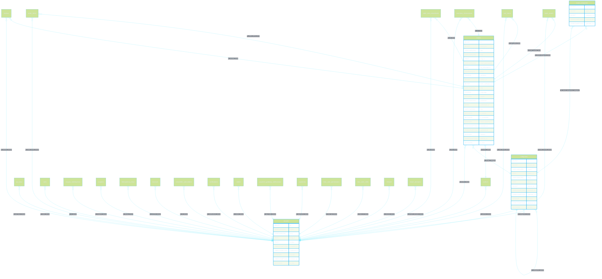

```mermaid
%%{init: {"theme":"forest","themeVariables":{"primaryColor":"#0b1021","primaryBorderColor":"#4ade80","primaryTextColor":"#e2e8f0","edgeLabelBackground":"#0b1021","tertiaryColor":"#111827","tertiaryTextColor":"#cbd5e1","lineColor":"#67e8f9","nodeBorder":"#38bdf8","textColor":"#e2e8f0"}} }%%
%% Detail ERD for categories (engine: postgres, neighbors: 3)
erDiagram
  %% direction: TB
  categories {
    BIGINT id
    BIGINT tenant_id
    VARCHAR(255) name
    TEXT name_ci
    VARCHAR(255) slug
    TEXT slug_ci
    BIGINT parent_id
    TIMESTAMPTZ(6) created_at
    TIMESTAMPTZ(6) updated_at
    INTEGER version
    TIMESTAMPTZ(6) deleted_at
    BOOLEAN is_live
  }
  book_categories {
    BIGINT tenant_id
    BIGINT book_id
    BIGINT category_id
    TIMESTAMPTZ(6) created_at
    TIMESTAMPTZ(6) updated_at
  }
  books {
    BIGINT id
    BIGINT tenant_id
    VARCHAR(255) title
    VARCHAR(255) slug
    TEXT slug_ci
    VARCHAR(512) short_description
    TEXT full_description
    NUMERIC(12) price
    CHAR(3) currency
    BIGINT author_id
    BIGINT main_category_id
    VARCHAR(32) isbn
    CHAR(5) language
    INTEGER pages
    VARCHAR(255) publisher
    DATE published_at
    VARCHAR(64) sku
    BOOLEAN is_active
    BOOLEAN is_available
    INTEGER stock_quantity
    TIMESTAMPTZ(6) created_at
    TIMESTAMPTZ(6) updated_at
    INTEGER version
    TIMESTAMPTZ(6) deleted_at
    BOOLEAN is_live
  }
  tenants {
    BIGINT id
    VARCHAR(200) name
    VARCHAR(200) slug
    TEXT slug_ci
    TEXT status
    TIMESTAMPTZ(6) created_at
    TIMESTAMPTZ(6) updated_at
    INTEGER version
    TIMESTAMPTZ(6) deleted_at
    BOOLEAN is_live
  }
api_keys }o--|| tenants : fk_api_keys_tenant
authors }o--|| tenants : fk_authors_tenant
book_assets }o--|| books : fk_book_assets_book
book_assets }o--|| tenants : fk_book_assets_tenant
book_categories }o--|| books : fk_book_categories_book
book_categories }o--|| categories : fk_book_categories_category
books }o--|| authors : fk_books_author
books }o--|| categories : fk_books_category
books }o--|| tenants : fk_books_tenant
cart_items }o--|| books : fk_cart_items_book
cart_items }o--|| tenants : fk_cart_items_tenant
carts }o--|| tenants : fk_carts_tenant
categories }o--|| categories : fk_categories_parent
categories }o--|| tenants : fk_categories_tenant
coupon_redemptions }o--|| tenants : fk_cr_tenant
coupons }o--|| tenants : fk_coupons_tenant
idempotency_keys }o--|| tenants : fk_idemp_tenant
inventory_reservations }o--|| books : fk_res_book
inventory_reservations }o--|| tenants : fk_res_tenant
invoices }o--|| tenants : fk_invoices_tenant
newsletter_subscribers }o--|| tenants : fk_ns_tenant
notifications }o--|| tenants : fk_notifications_tenant
order_item_downloads }o--|| books : fk_oid_book
order_item_downloads }o--|| tenants : fk_oid_tenant
order_items }o--|| books : fk_order_items_book
order_items }o--|| tenants : fk_order_items_tenant
orders }o--|| tenants : fk_orders_tenant
payment_gateway_notifications }o--|| tenants : fk_pg_notify_tenant
payments }o--|| tenants : fk_payments_tenant
rbac_user_permissions }o--|| tenants : fk_rbac_up_tenant
rbac_user_roles }o--|| tenants : fk_rbac_ur_tenant
refunds }o--|| tenants : fk_refunds_tenant
reviews }o--|| books : fk_reviews_book
reviews }o--|| tenants : fk_reviews_tenant
tenant_domains }o--|| tenants : fk_tenant_domains_tenant
```
