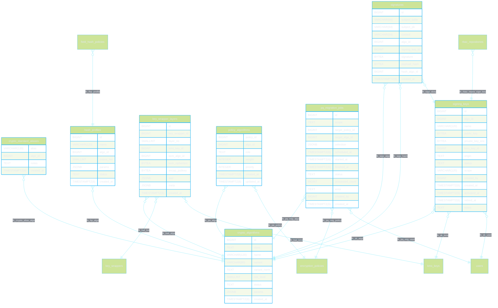

```mermaid
%%{init: {"theme":"forest","themeVariables":{"primaryColor":"#0b1021","primaryBorderColor":"#4ade80","primaryTextColor":"#e2e8f0","edgeLabelBackground":"#0b1021","tertiaryColor":"#111827","tertiaryTextColor":"#cbd5e1","lineColor":"#67e8f9","nodeBorder":"#38bdf8","textColor":"#e2e8f0"}} }%%
%% Detail ERD for crypto_algorithms (engine: postgres, neighbors: 7)
erDiagram
  %% direction: TB
  crypto_algorithms {
    BIGINT id
    TEXT class
    VARCHAR(120) name
    VARCHAR(80) variant
    TEXT variant_norm
    SMALLINT nist_level
    TEXT status
    JSONB params
    TIMESTAMPTZ(6) created_at
  }
  crypto_standard_aliases {
    VARCHAR(120) alias
    BIGINT algo_id
    TEXT notes
    TIMESTAMPTZ(6) created_at
  }
  hash_profiles {
    BIGINT id
    VARCHAR(120) name
    BIGINT algo_id
    SMALLINT output_len
    JSONB params
    TEXT status
    TIMESTAMPTZ(6) created_at
  }
  key_wrapper_layers {
    BIGINT id
    BIGINT key_wrapper_id
    SMALLINT layer_no
    BIGINT kms_key_id
    BIGINT kem_algo_id
    BYTEA kem_ciphertext
    BYTEA encap_pubkey
    JSONB aad
    JSONB meta
    TIMESTAMPTZ(6) created_at
  }
  policy_algorithms {
    BIGINT policy_id
    BIGINT algo_id
    TEXT role
    INTEGER weight
    INTEGER priority
    TIMESTAMPTZ(6) created_at
    TIMESTAMPTZ(6) updated_at
  }
  pq_migration_jobs {
    BIGINT id
    TEXT scope
    BIGINT target_policy_id
    BIGINT target_algo_id
    JSONB selection
    TIMESTAMPTZ(6) scheduled_at
    TIMESTAMPTZ(6) started_at
    TIMESTAMPTZ(6) finished_at
    TEXT status
    BIGINT processed_count
    TEXT error
    BIGINT created_by
    TIMESTAMPTZ(6) created_at
  }
  signatures {
    BIGINT id
    VARCHAR(64) subject_table
    VARCHAR(64) subject_pk
    VARCHAR(64) context
    BIGINT algo_id
    BIGINT signing_key_id
    BYTEA signature
    BYTEA payload_hash
    BIGINT hash_algo_id
    TIMESTAMPTZ(6) created_at
  }
  signing_keys {
    BIGINT id
    BIGINT algo_id
    VARCHAR(120) name
    BYTEA public_key
    BYTEA private_key_enc
    BIGINT kms_key_id
    TEXT origin
    TEXT status
    VARCHAR(120) scope
    BIGINT created_by
    TIMESTAMPTZ(6) created_at
    TIMESTAMPTZ(6) activated_at
    TIMESTAMPTZ(6) retired_at
    TEXT notes
  }
crypto_standard_aliases }o--|| crypto_algorithms : fk_crypto_alias_algo
field_hash_policies }o--|| hash_profiles : fk_fhp_profile
hash_profiles }o--|| crypto_algorithms : fk_hp_algo
key_wrapper_layers }o--|| crypto_algorithms : fk_kwl_algo
key_wrapper_layers }o--|| key_wrappers : fk_kwl_kw
key_wrapper_layers }o--|| kms_keys : fk_kwl_kms
policy_algorithms }o--|| crypto_algorithms : fk_pa_algo
policy_algorithms }o--|| encryption_policies : fk_pa_policy
pq_migration_jobs }o--|| crypto_algorithms : fk_pq_mig_algo
pq_migration_jobs }o--|| encryption_policies : fk_pq_mig_policy
pq_migration_jobs }o--|| users : fk_pq_mig_user
rbac_repositories }o--|| signing_keys : fk_rbac_repos_sign_key
signatures }o--|| crypto_algorithms : fk_sigs_algo
signatures }o--|| crypto_algorithms : fk_sigs_hash
signatures }o--|| signing_keys : fk_sigs_skey
signing_keys }o--|| crypto_algorithms : fk_sk_algo
signing_keys }o--|| kms_keys : fk_sk_kms
signing_keys }o--|| users : fk_sk_user
```
