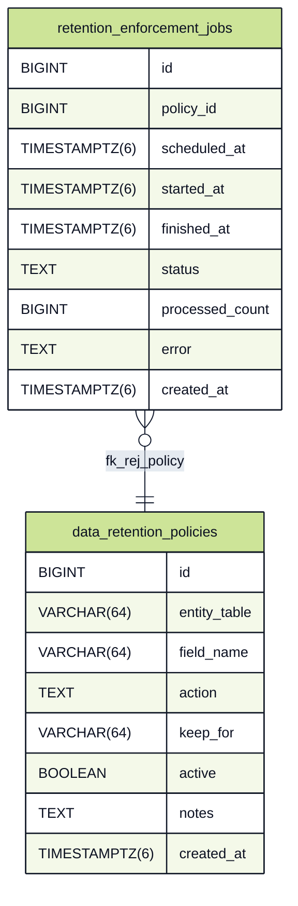

```mermaid
%%{init: {"theme":"forest","themeVariables":{"primaryColor":"#e5e7eb","primaryBorderColor":"#111827","primaryTextColor":"#0b1021","edgeLabelBackground":"#f8fafc","tertiaryColor":"#cbd5e1","tertiaryTextColor":"#0f172a","lineColor":"#0f172a","nodeBorder":"#111827","textColor":"#0b1021","fontSize":"14px"}} }%%
%% Detail ERD for data_retention_policies (engine: postgres, neighbors: 1)
erDiagram
  direction TB
  data_retention_policies {
    BIGINT id
    VARCHAR(64) entity_table
    VARCHAR(64) field_name
    TEXT action
    VARCHAR(64) keep_for
    BOOLEAN active
    TEXT notes
    TIMESTAMPTZ(6) created_at
  }
  retention_enforcement_jobs {
    BIGINT id
    BIGINT policy_id
    TIMESTAMPTZ(6) scheduled_at
    TIMESTAMPTZ(6) started_at
    TIMESTAMPTZ(6) finished_at
    TEXT status
    BIGINT processed_count
    TEXT error
    TIMESTAMPTZ(6) created_at
  }
retention_enforcement_jobs }o--|| data_retention_policies : fk_rej_policy
```
