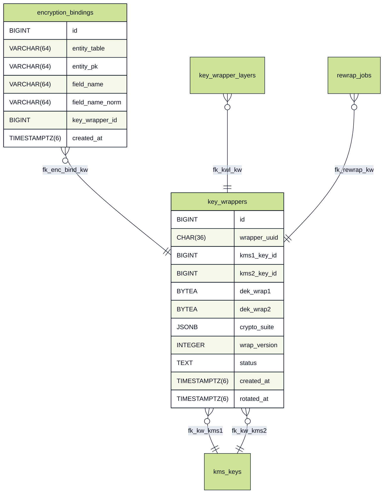

```mermaid
%%{init: {"theme":"forest","themeVariables":{"primaryColor":"#e5e7eb","primaryBorderColor":"#111827","primaryTextColor":"#0b1021","edgeLabelBackground":"#f8fafc","tertiaryColor":"#cbd5e1","tertiaryTextColor":"#0f172a","lineColor":"#0f172a","nodeBorder":"#111827","textColor":"#0b1021","fontSize":"14px"}} }%%
%% Detail ERD for encryption_bindings (engine: postgres, neighbors: 1)
erDiagram
  direction TB
  encryption_bindings {
    BIGINT id
    VARCHAR(64) entity_table
    VARCHAR(64) entity_pk
    VARCHAR(64) field_name
    VARCHAR(64) field_name_norm
    BIGINT key_wrapper_id
    TIMESTAMPTZ(6) created_at
  }
  key_wrappers {
    BIGINT id
    CHAR(36) wrapper_uuid
    BIGINT kms1_key_id
    BIGINT kms2_key_id
    BYTEA dek_wrap1
    BYTEA dek_wrap2
    JSONB crypto_suite
    INTEGER wrap_version
    TEXT status
    TIMESTAMPTZ(6) created_at
    TIMESTAMPTZ(6) rotated_at
  }
encryption_bindings }o--|| key_wrappers : fk_enc_bind_kw
key_wrapper_layers }o--|| key_wrappers : fk_kwl_kw
key_wrappers }o--|| kms_keys : fk_kw_kms1
key_wrappers }o--|| kms_keys : fk_kw_kms2
rewrap_jobs }o--|| key_wrappers : fk_rewrap_kw
```
