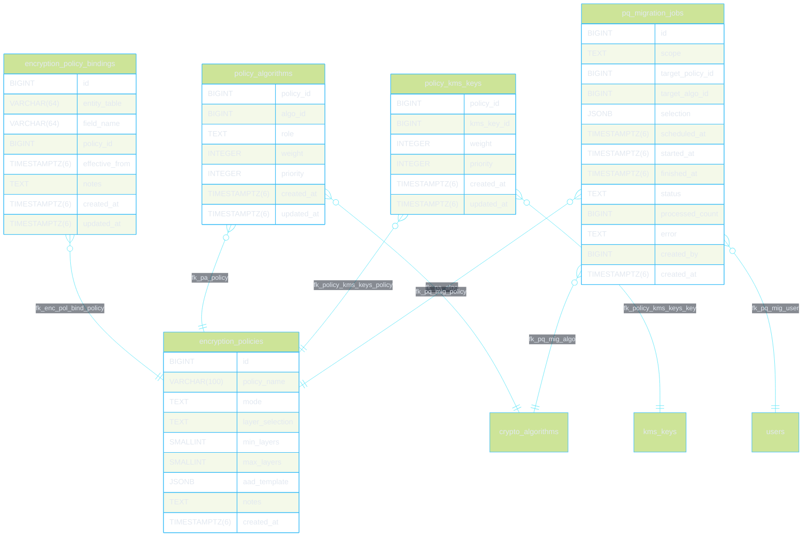

```mermaid
%%{init: {"theme":"forest","themeVariables":{"primaryColor":"#0b1021","primaryBorderColor":"#4ade80","primaryTextColor":"#e2e8f0","edgeLabelBackground":"#0b1021","tertiaryColor":"#111827","tertiaryTextColor":"#cbd5e1","lineColor":"#67e8f9","nodeBorder":"#38bdf8","textColor":"#e2e8f0"}} }%%
%% Detail ERD for encryption_policies (engine: postgres, neighbors: 4)
erDiagram
  %% direction: TB
  encryption_policies {
    BIGINT id
    VARCHAR(100) policy_name
    TEXT mode
    TEXT layer_selection
    SMALLINT min_layers
    SMALLINT max_layers
    JSONB aad_template
    TEXT notes
    TIMESTAMPTZ(6) created_at
  }
  encryption_policy_bindings {
    BIGINT id
    VARCHAR(64) entity_table
    VARCHAR(64) field_name
    BIGINT policy_id
    TIMESTAMPTZ(6) effective_from
    TEXT notes
    TIMESTAMPTZ(6) created_at
    TIMESTAMPTZ(6) updated_at
  }
  policy_algorithms {
    BIGINT policy_id
    BIGINT algo_id
    TEXT role
    INTEGER weight
    INTEGER priority
    TIMESTAMPTZ(6) created_at
    TIMESTAMPTZ(6) updated_at
  }
  policy_kms_keys {
    BIGINT policy_id
    BIGINT kms_key_id
    INTEGER weight
    INTEGER priority
    TIMESTAMPTZ(6) created_at
    TIMESTAMPTZ(6) updated_at
  }
  pq_migration_jobs {
    BIGINT id
    TEXT scope
    BIGINT target_policy_id
    BIGINT target_algo_id
    JSONB selection
    TIMESTAMPTZ(6) scheduled_at
    TIMESTAMPTZ(6) started_at
    TIMESTAMPTZ(6) finished_at
    TEXT status
    BIGINT processed_count
    TEXT error
    BIGINT created_by
    TIMESTAMPTZ(6) created_at
  }
encryption_policy_bindings }o--|| encryption_policies : fk_enc_pol_bind_policy
policy_algorithms }o--|| crypto_algorithms : fk_pa_algo
policy_algorithms }o--|| encryption_policies : fk_pa_policy
policy_kms_keys }o--|| encryption_policies : fk_policy_kms_keys_policy
policy_kms_keys }o--|| kms_keys : fk_policy_kms_keys_key
pq_migration_jobs }o--|| crypto_algorithms : fk_pq_mig_algo
pq_migration_jobs }o--|| encryption_policies : fk_pq_mig_policy
pq_migration_jobs }o--|| users : fk_pq_mig_user
```
