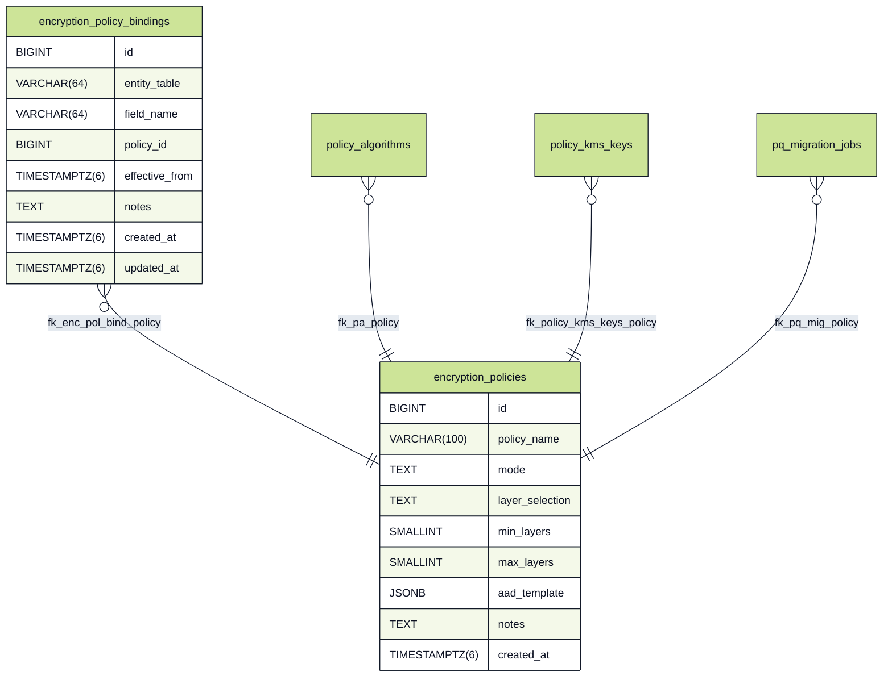

```mermaid
%%{init: {"theme":"forest","themeVariables":{"primaryColor":"#e5e7eb","primaryBorderColor":"#111827","primaryTextColor":"#0b1021","edgeLabelBackground":"#f8fafc","tertiaryColor":"#cbd5e1","tertiaryTextColor":"#0f172a","lineColor":"#0f172a","nodeBorder":"#111827","textColor":"#0b1021","fontSize":"14px"}} }%%
%% Detail ERD for encryption_policy_bindings (engine: postgres, neighbors: 1)
erDiagram
  direction TB
  encryption_policy_bindings {
    BIGINT id
    VARCHAR(64) entity_table
    VARCHAR(64) field_name
    BIGINT policy_id
    TIMESTAMPTZ(6) effective_from
    TEXT notes
    TIMESTAMPTZ(6) created_at
    TIMESTAMPTZ(6) updated_at
  }
  encryption_policies {
    BIGINT id
    VARCHAR(100) policy_name
    TEXT mode
    TEXT layer_selection
    SMALLINT min_layers
    SMALLINT max_layers
    JSONB aad_template
    TEXT notes
    TIMESTAMPTZ(6) created_at
  }
encryption_policy_bindings }o--|| encryption_policies : fk_enc_pol_bind_policy
policy_algorithms }o--|| encryption_policies : fk_pa_policy
policy_kms_keys }o--|| encryption_policies : fk_policy_kms_keys_policy
pq_migration_jobs }o--|| encryption_policies : fk_pq_mig_policy
```
