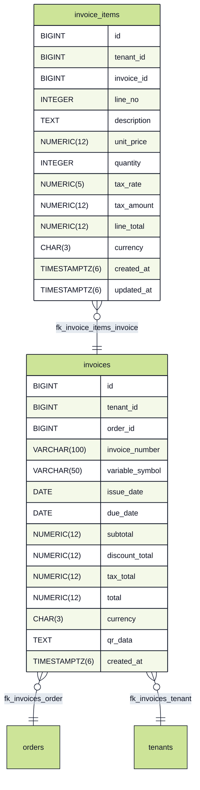

```mermaid
%%{init: {"theme":"forest","themeVariables":{"primaryColor":"#e5e7eb","primaryBorderColor":"#111827","primaryTextColor":"#0b1021","edgeLabelBackground":"#f8fafc","tertiaryColor":"#cbd5e1","tertiaryTextColor":"#0f172a","lineColor":"#0f172a","nodeBorder":"#111827","textColor":"#0b1021","fontSize":"14px"}} }%%
%% Detail ERD for invoice_items (engine: postgres, neighbors: 1)
erDiagram
  direction TB
  invoice_items {
    BIGINT id
    BIGINT tenant_id
    BIGINT invoice_id
    INTEGER line_no
    TEXT description
    NUMERIC(12) unit_price
    INTEGER quantity
    NUMERIC(5) tax_rate
    NUMERIC(12) tax_amount
    NUMERIC(12) line_total
    CHAR(3) currency
    TIMESTAMPTZ(6) created_at
    TIMESTAMPTZ(6) updated_at
  }
  invoices {
    BIGINT id
    BIGINT tenant_id
    BIGINT order_id
    VARCHAR(100) invoice_number
    VARCHAR(50) variable_symbol
    DATE issue_date
    DATE due_date
    NUMERIC(12) subtotal
    NUMERIC(12) discount_total
    NUMERIC(12) tax_total
    NUMERIC(12) total
    CHAR(3) currency
    TEXT qr_data
    TIMESTAMPTZ(6) created_at
  }
invoice_items }o--|| invoices : fk_invoice_items_invoice
invoices }o--|| orders : fk_invoices_order
invoices }o--|| tenants : fk_invoices_tenant
```
