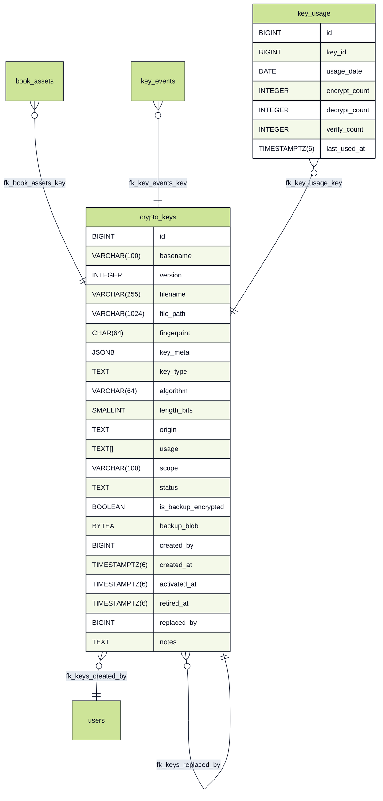

```mermaid
%%{init: {"theme":"forest","themeVariables":{"primaryColor":"#e5e7eb","primaryBorderColor":"#111827","primaryTextColor":"#0b1021","edgeLabelBackground":"#f8fafc","tertiaryColor":"#cbd5e1","tertiaryTextColor":"#0f172a","lineColor":"#0f172a","nodeBorder":"#111827","textColor":"#0b1021","fontSize":"14px"}} }%%
%% Detail ERD for key_usage (engine: postgres, neighbors: 1)
erDiagram
  direction TB
  key_usage {
    BIGINT id
    BIGINT key_id
    DATE usage_date
    INTEGER encrypt_count
    INTEGER decrypt_count
    INTEGER verify_count
    TIMESTAMPTZ(6) last_used_at
  }
  crypto_keys {
    BIGINT id
    VARCHAR(100) basename
    INTEGER version
    VARCHAR(255) filename
    VARCHAR(1024) file_path
    CHAR(64) fingerprint
    JSONB key_meta
    TEXT key_type
    VARCHAR(64) algorithm
    SMALLINT length_bits
    TEXT origin
    TEXT[] usage
    VARCHAR(100) scope
    TEXT status
    BOOLEAN is_backup_encrypted
    BYTEA backup_blob
    BIGINT created_by
    TIMESTAMPTZ(6) created_at
    TIMESTAMPTZ(6) activated_at
    TIMESTAMPTZ(6) retired_at
    BIGINT replaced_by
    TEXT notes
  }
book_assets }o--|| crypto_keys : fk_book_assets_key
crypto_keys }o--|| crypto_keys : fk_keys_replaced_by
crypto_keys }o--|| users : fk_keys_created_by
key_events }o--|| crypto_keys : fk_key_events_key
key_usage }o--|| crypto_keys : fk_key_usage_key
```
