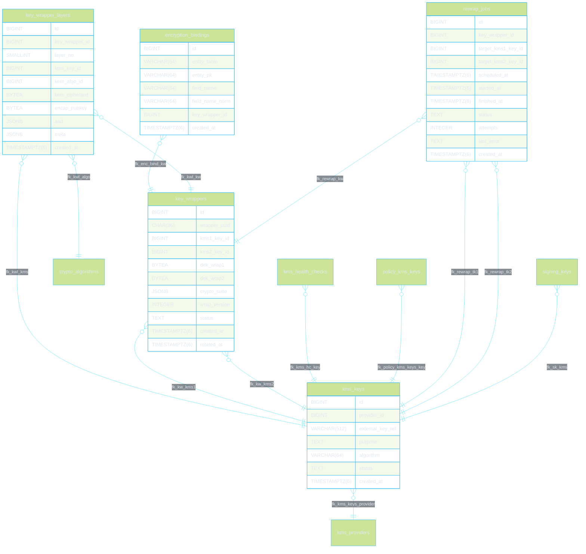

```mermaid
%%{init: {"theme":"forest","themeVariables":{"primaryColor":"#0b1021","primaryBorderColor":"#4ade80","primaryTextColor":"#e2e8f0","edgeLabelBackground":"#0b1021","tertiaryColor":"#111827","tertiaryTextColor":"#cbd5e1","lineColor":"#67e8f9","nodeBorder":"#38bdf8","textColor":"#e2e8f0"}} }%%
%% Detail ERD for key_wrappers (engine: postgres, neighbors: 4)
erDiagram
  %% direction: TB
  key_wrappers {
    BIGINT id
    CHAR(36) wrapper_uuid
    BIGINT kms1_key_id
    BIGINT kms2_key_id
    BYTEA dek_wrap1
    BYTEA dek_wrap2
    JSONB crypto_suite
    INTEGER wrap_version
    TEXT status
    TIMESTAMPTZ(6) created_at
    TIMESTAMPTZ(6) rotated_at
  }
  encryption_bindings {
    BIGINT id
    VARCHAR(64) entity_table
    VARCHAR(64) entity_pk
    VARCHAR(64) field_name
    VARCHAR(64) field_name_norm
    BIGINT key_wrapper_id
    TIMESTAMPTZ(6) created_at
  }
  key_wrapper_layers {
    BIGINT id
    BIGINT key_wrapper_id
    SMALLINT layer_no
    BIGINT kms_key_id
    BIGINT kem_algo_id
    BYTEA kem_ciphertext
    BYTEA encap_pubkey
    JSONB aad
    JSONB meta
    TIMESTAMPTZ(6) created_at
  }
  kms_keys {
    BIGINT id
    BIGINT provider_id
    VARCHAR(512) external_key_ref
    TEXT purpose
    VARCHAR(64) algorithm
    TEXT status
    TIMESTAMPTZ(6) created_at
  }
  rewrap_jobs {
    BIGINT id
    BIGINT key_wrapper_id
    BIGINT target_kms1_key_id
    BIGINT target_kms2_key_id
    TIMESTAMPTZ(6) scheduled_at
    TIMESTAMPTZ(6) started_at
    TIMESTAMPTZ(6) finished_at
    TEXT status
    INTEGER attempts
    TEXT last_error
    TIMESTAMPTZ(6) created_at
  }
encryption_bindings }o--|| key_wrappers : fk_enc_bind_kw
key_wrapper_layers }o--|| crypto_algorithms : fk_kwl_algo
key_wrapper_layers }o--|| key_wrappers : fk_kwl_kw
key_wrapper_layers }o--|| kms_keys : fk_kwl_kms
key_wrappers }o--|| kms_keys : fk_kw_kms1
key_wrappers }o--|| kms_keys : fk_kw_kms2
kms_health_checks }o--|| kms_keys : fk_kms_hc_key
kms_keys }o--|| kms_providers : fk_kms_keys_provider
policy_kms_keys }o--|| kms_keys : fk_policy_kms_keys_key
rewrap_jobs }o--|| key_wrappers : fk_rewrap_kw
rewrap_jobs }o--|| kms_keys : fk_rewrap_tk1
rewrap_jobs }o--|| kms_keys : fk_rewrap_tk2
signing_keys }o--|| kms_keys : fk_sk_kms
```
