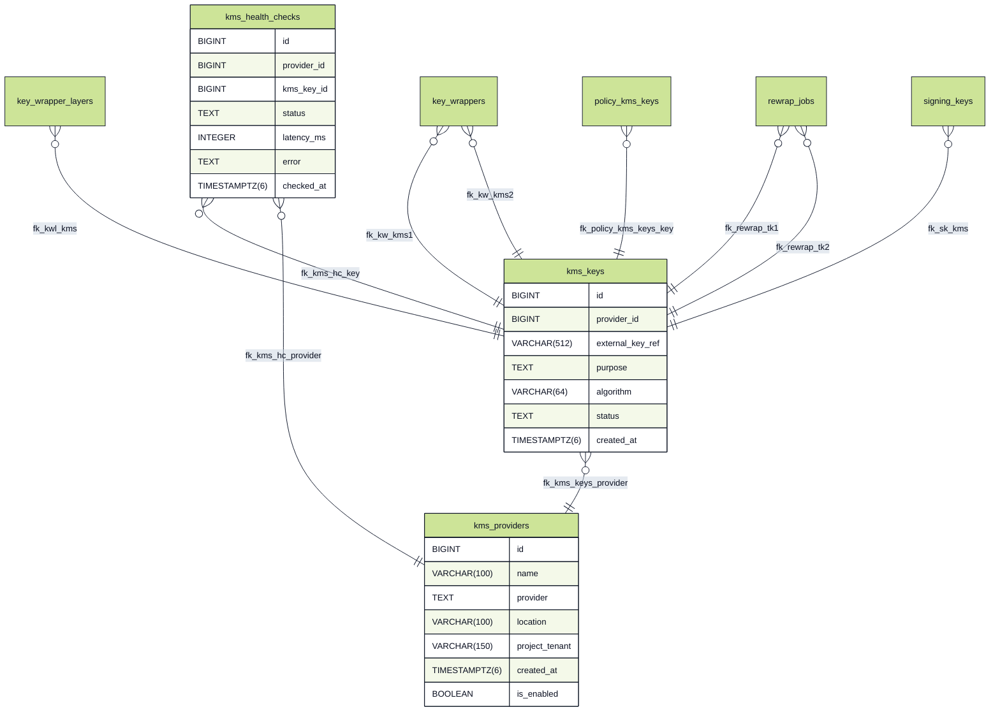

```mermaid
%%{init: {"theme":"forest","themeVariables":{"primaryColor":"#e5e7eb","primaryBorderColor":"#111827","primaryTextColor":"#0b1021","edgeLabelBackground":"#f8fafc","tertiaryColor":"#cbd5e1","tertiaryTextColor":"#0f172a","lineColor":"#0f172a","nodeBorder":"#111827","textColor":"#0b1021","fontSize":"14px"}} }%%
%% Detail ERD for kms_health_checks (engine: postgres, neighbors: 2)
erDiagram
  direction TB
  kms_health_checks {
    BIGINT id
    BIGINT provider_id
    BIGINT kms_key_id
    TEXT status
    INTEGER latency_ms
    TEXT error
    TIMESTAMPTZ(6) checked_at
  }
  kms_keys {
    BIGINT id
    BIGINT provider_id
    VARCHAR(512) external_key_ref
    TEXT purpose
    VARCHAR(64) algorithm
    TEXT status
    TIMESTAMPTZ(6) created_at
  }
  kms_providers {
    BIGINT id
    VARCHAR(100) name
    TEXT provider
    VARCHAR(100) location
    VARCHAR(150) project_tenant
    TIMESTAMPTZ(6) created_at
    BOOLEAN is_enabled
  }
key_wrapper_layers }o--|| kms_keys : fk_kwl_kms
key_wrappers }o--|| kms_keys : fk_kw_kms1
key_wrappers }o--|| kms_keys : fk_kw_kms2
kms_health_checks }o--|| kms_keys : fk_kms_hc_key
kms_health_checks }o--|| kms_providers : fk_kms_hc_provider
kms_keys }o--|| kms_providers : fk_kms_keys_provider
policy_kms_keys }o--|| kms_keys : fk_policy_kms_keys_key
rewrap_jobs }o--|| kms_keys : fk_rewrap_tk1
rewrap_jobs }o--|| kms_keys : fk_rewrap_tk2
signing_keys }o--|| kms_keys : fk_sk_kms
```
