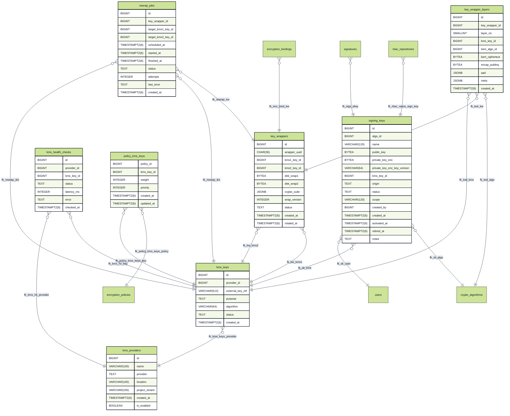

```mermaid
%%{init: {"theme":"forest","themeVariables":{"primaryColor":"#e5e7eb","primaryBorderColor":"#111827","primaryTextColor":"#0b1021","edgeLabelBackground":"#f8fafc","tertiaryColor":"#cbd5e1","tertiaryTextColor":"#0f172a","lineColor":"#0f172a","nodeBorder":"#111827","textColor":"#0b1021","fontSize":"14px"}} }%%
%% Detail ERD for kms_keys (engine: postgres, neighbors: 7)
erDiagram
  direction TB
  kms_keys {
    BIGINT id
    BIGINT provider_id
    VARCHAR(512) external_key_ref
    TEXT purpose
    VARCHAR(64) algorithm
    TEXT status
    TIMESTAMPTZ(6) created_at
  }
  key_wrapper_layers {
    BIGINT id
    BIGINT key_wrapper_id
    SMALLINT layer_no
    BIGINT kms_key_id
    BIGINT kem_algo_id
    BYTEA kem_ciphertext
    BYTEA encap_pubkey
    JSONB aad
    JSONB meta
    TIMESTAMPTZ(6) created_at
  }
  key_wrappers {
    BIGINT id
    CHAR(36) wrapper_uuid
    BIGINT kms1_key_id
    BIGINT kms2_key_id
    BYTEA dek_wrap1
    BYTEA dek_wrap2
    JSONB crypto_suite
    INTEGER wrap_version
    TEXT status
    TIMESTAMPTZ(6) created_at
    TIMESTAMPTZ(6) rotated_at
  }
  kms_health_checks {
    BIGINT id
    BIGINT provider_id
    BIGINT kms_key_id
    TEXT status
    INTEGER latency_ms
    TEXT error
    TIMESTAMPTZ(6) checked_at
  }
  kms_providers {
    BIGINT id
    VARCHAR(100) name
    TEXT provider
    VARCHAR(100) location
    VARCHAR(150) project_tenant
    TIMESTAMPTZ(6) created_at
    BOOLEAN is_enabled
  }
  policy_kms_keys {
    BIGINT policy_id
    BIGINT kms_key_id
    INTEGER weight
    INTEGER priority
    TIMESTAMPTZ(6) created_at
    TIMESTAMPTZ(6) updated_at
  }
  rewrap_jobs {
    BIGINT id
    BIGINT key_wrapper_id
    BIGINT target_kms1_key_id
    BIGINT target_kms2_key_id
    TIMESTAMPTZ(6) scheduled_at
    TIMESTAMPTZ(6) started_at
    TIMESTAMPTZ(6) finished_at
    TEXT status
    INTEGER attempts
    TEXT last_error
    TIMESTAMPTZ(6) created_at
  }
  signing_keys {
    BIGINT id
    BIGINT algo_id
    VARCHAR(120) name
    BYTEA public_key
    BYTEA private_key_enc
    VARCHAR(64) private_key_enc_key_version
    BIGINT kms_key_id
    TEXT origin
    TEXT status
    VARCHAR(120) scope
    BIGINT created_by
    TIMESTAMPTZ(6) created_at
    TIMESTAMPTZ(6) activated_at
    TIMESTAMPTZ(6) retired_at
    TEXT notes
  }
encryption_bindings }o--|| key_wrappers : fk_enc_bind_kw
key_wrapper_layers }o--|| crypto_algorithms : fk_kwl_algo
key_wrapper_layers }o--|| key_wrappers : fk_kwl_kw
key_wrapper_layers }o--|| kms_keys : fk_kwl_kms
key_wrappers }o--|| kms_keys : fk_kw_kms1
key_wrappers }o--|| kms_keys : fk_kw_kms2
kms_health_checks }o--|| kms_keys : fk_kms_hc_key
kms_health_checks }o--|| kms_providers : fk_kms_hc_provider
kms_keys }o--|| kms_providers : fk_kms_keys_provider
policy_kms_keys }o--|| encryption_policies : fk_policy_kms_keys_policy
policy_kms_keys }o--|| kms_keys : fk_policy_kms_keys_key
rbac_repositories }o--|| signing_keys : fk_rbac_repos_sign_key
rewrap_jobs }o--|| key_wrappers : fk_rewrap_kw
rewrap_jobs }o--|| kms_keys : fk_rewrap_tk1
rewrap_jobs }o--|| kms_keys : fk_rewrap_tk2
signatures }o--|| signing_keys : fk_sigs_skey
signing_keys }o--|| crypto_algorithms : fk_sk_algo
signing_keys }o--|| kms_keys : fk_sk_kms
signing_keys }o--|| users : fk_sk_user
```
