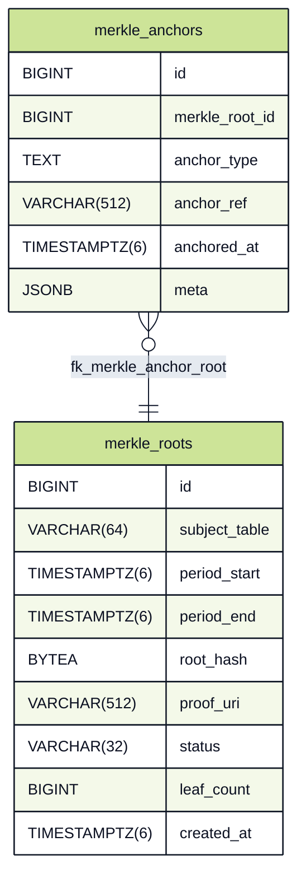

```mermaid
%%{init: {"theme":"forest","themeVariables":{"primaryColor":"#e5e7eb","primaryBorderColor":"#111827","primaryTextColor":"#0b1021","edgeLabelBackground":"#f8fafc","tertiaryColor":"#cbd5e1","tertiaryTextColor":"#0f172a","lineColor":"#0f172a","nodeBorder":"#111827","textColor":"#0b1021","fontSize":"14px"}} }%%
%% Detail ERD for merkle_anchors (engine: postgres, neighbors: 1)
erDiagram
  direction TB
  merkle_anchors {
    BIGINT id
    BIGINT merkle_root_id
    TEXT anchor_type
    VARCHAR(512) anchor_ref
    TIMESTAMPTZ(6) anchored_at
    JSONB meta
  }
  merkle_roots {
    BIGINT id
    VARCHAR(64) subject_table
    TIMESTAMPTZ(6) period_start
    TIMESTAMPTZ(6) period_end
    BYTEA root_hash
    VARCHAR(512) proof_uri
    VARCHAR(32) status
    BIGINT leaf_count
    TIMESTAMPTZ(6) created_at
  }
merkle_anchors }o--|| merkle_roots : fk_merkle_anchor_root
```
