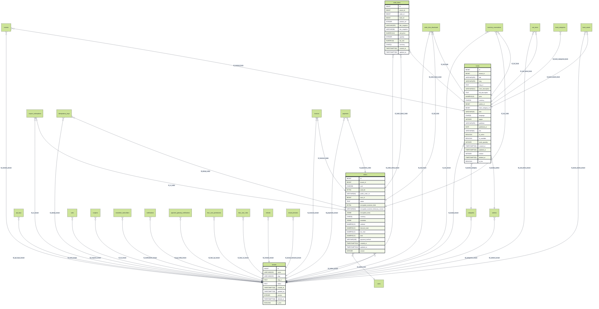

```mermaid
%%{init: {"theme":"forest","themeVariables":{"primaryColor":"#e5e7eb","primaryBorderColor":"#111827","primaryTextColor":"#0b1021","edgeLabelBackground":"#f8fafc","tertiaryColor":"#cbd5e1","tertiaryTextColor":"#0f172a","lineColor":"#0f172a","nodeBorder":"#111827","textColor":"#0b1021","fontSize":"14px"}} }%%
%% Detail ERD for order_items (engine: postgres, neighbors: 3)
erDiagram
  direction TB
  order_items {
    BIGINT id
    BIGINT tenant_id
    BIGINT order_id
    BIGINT book_id
    INTEGER product_ref
    VARCHAR(255) title_snapshot
    VARCHAR(64) sku_snapshot
    NUMERIC(12) unit_price
    INTEGER quantity
    NUMERIC(5) tax_rate
    CHAR(3) currency
    TIMESTAMPTZ(6) created_at
    TIMESTAMPTZ(6) updated_at
  }
  books {
    BIGINT id
    BIGINT tenant_id
    VARCHAR(255) title
    VARCHAR(255) slug
    TEXT slug_ci
    VARCHAR(512) short_description
    TEXT full_description
    NUMERIC(12) price
    CHAR(3) currency
    BIGINT author_id
    BIGINT main_category_id
    VARCHAR(32) isbn
    CHAR(5) language
    INTEGER pages
    VARCHAR(255) publisher
    DATE published_at
    VARCHAR(64) sku
    BOOLEAN is_active
    BOOLEAN is_available
    INTEGER stock_quantity
    TIMESTAMPTZ(6) created_at
    TIMESTAMPTZ(6) updated_at
    INTEGER version
    TIMESTAMPTZ(6) deleted_at
    BOOLEAN is_live
  }
  orders {
    BIGINT id
    BIGINT tenant_id
    CHAR(36) uuid
    BYTEA uuid_bin
    VARCHAR(64) public_order_no
    BIGINT user_id
    TEXT status
    BYTEA encrypted_customer_blob
    VARCHAR(64) encrypted_customer_blob_key_version
    JSONB encryption_meta
    CHAR(3) currency
    JSONB metadata
    NUMERIC(12) subtotal
    NUMERIC(12) discount_total
    NUMERIC(12) tax_total
    NUMERIC(12) total
    VARCHAR(100) payment_method
    TIMESTAMPTZ(6) created_at
    TIMESTAMPTZ(6) updated_at
    INTEGER version
  }
  tenants {
    BIGINT id
    VARCHAR(200) name
    VARCHAR(200) slug
    TEXT slug_ci
    TEXT status
    TIMESTAMPTZ(6) created_at
    TIMESTAMPTZ(6) updated_at
    INTEGER version
    TIMESTAMPTZ(6) deleted_at
    BOOLEAN is_live
  }
api_keys }o--|| tenants : fk_api_keys_tenant
authors }o--|| tenants : fk_authors_tenant
book_assets }o--|| books : fk_book_assets_book
book_assets }o--|| tenants : fk_book_assets_tenant
book_categories }o--|| books : fk_book_categories_book
books }o--|| authors : fk_books_author
books }o--|| categories : fk_books_category
books }o--|| tenants : fk_books_tenant
cart_items }o--|| books : fk_cart_items_book
cart_items }o--|| tenants : fk_cart_items_tenant
carts }o--|| tenants : fk_carts_tenant
categories }o--|| tenants : fk_categories_tenant
coupon_redemptions }o--|| orders : fk_cr_order
coupon_redemptions }o--|| tenants : fk_cr_tenant
coupons }o--|| tenants : fk_coupons_tenant
idempotency_keys }o--|| orders : fk_idemp_order
idempotency_keys }o--|| tenants : fk_idemp_tenant
inventory_reservations }o--|| books : fk_res_book
inventory_reservations }o--|| orders : fk_res_order
inventory_reservations }o--|| tenants : fk_res_tenant
invoices }o--|| orders : fk_invoices_order
invoices }o--|| tenants : fk_invoices_tenant
newsletter_subscribers }o--|| tenants : fk_ns_tenant
notifications }o--|| tenants : fk_notifications_tenant
order_item_downloads }o--|| books : fk_oid_book
order_item_downloads }o--|| orders : fk_oid_order
order_item_downloads }o--|| tenants : fk_oid_tenant
order_items }o--|| books : fk_order_items_book
order_items }o--|| orders : fk_order_items_order
order_items }o--|| tenants : fk_order_items_tenant
orders }o--|| tenants : fk_orders_tenant
orders }o--|| users : fk_orders_user
payment_gateway_notifications }o--|| tenants : fk_pg_notify_tenant
payments }o--|| orders : fk_payments_order
payments }o--|| tenants : fk_payments_tenant
rbac_user_permissions }o--|| tenants : fk_rbac_up_tenant
rbac_user_roles }o--|| tenants : fk_rbac_ur_tenant
refunds }o--|| tenants : fk_refunds_tenant
reviews }o--|| books : fk_reviews_book
reviews }o--|| tenants : fk_reviews_tenant
tenant_domains }o--|| tenants : fk_tenant_domains_tenant
```
