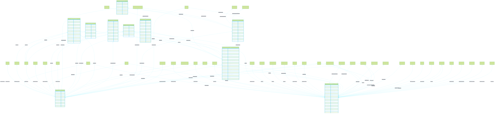

```mermaid
%%{init: {"theme":"forest","themeVariables":{"primaryColor":"#0b1021","primaryBorderColor":"#4ade80","primaryTextColor":"#e2e8f0","edgeLabelBackground":"#0b1021","tertiaryColor":"#111827","tertiaryTextColor":"#cbd5e1","lineColor":"#67e8f9","nodeBorder":"#38bdf8","textColor":"#e2e8f0"}} }%%
%% Detail ERD for orders (engine: postgres, neighbors: 9)
erDiagram
  %% direction: TB
  orders {
    BIGINT id
    BIGINT tenant_id
    CHAR(36) uuid
    BYTEA uuid_bin
    VARCHAR(64) public_order_no
    BIGINT user_id
    TEXT status
    BYTEA encrypted_customer_blob
    VARCHAR(64) encrypted_customer_blob_key_version
    JSONB encryption_meta
    CHAR(3) currency
    JSONB metadata
    NUMERIC(12) subtotal
    NUMERIC(12) discount_total
    NUMERIC(12) tax_total
    NUMERIC(12) total
    VARCHAR(100) payment_method
    TIMESTAMPTZ(6) created_at
    TIMESTAMPTZ(6) updated_at
    INTEGER version
  }
  coupon_redemptions {
    BIGINT id
    BIGINT tenant_id
    BIGINT coupon_id
    BIGINT user_id
    BIGINT order_id
    TIMESTAMPTZ(6) redeemed_at
    NUMERIC(12) amount_applied
  }
  idempotency_keys {
    CHAR(64) key_hash
    BIGINT tenant_id
    BIGINT payment_id
    BIGINT order_id
    JSONB gateway_payload
    VARCHAR(1024) redirect_url
    TIMESTAMPTZ(6) created_at
    INTEGER ttl_seconds
  }
  inventory_reservations {
    BIGINT id
    BIGINT tenant_id
    BIGINT order_id
    BIGINT book_id
    INTEGER quantity
    TIMESTAMPTZ(6) reserved_until
    TEXT status
    TIMESTAMPTZ(6) created_at
    INTEGER version
  }
  invoices {
    BIGINT id
    BIGINT tenant_id
    BIGINT order_id
    VARCHAR(100) invoice_number
    VARCHAR(50) variable_symbol
    DATE issue_date
    DATE due_date
    NUMERIC(12) subtotal
    NUMERIC(12) discount_total
    NUMERIC(12) tax_total
    NUMERIC(12) total
    CHAR(3) currency
    TEXT qr_data
    TIMESTAMPTZ(6) created_at
  }
  order_item_downloads {
    BIGINT id
    BIGINT tenant_id
    BIGINT order_id
    BIGINT book_id
    BIGINT asset_id
    BYTEA download_token_hash
    VARCHAR(64) token_key_version
    VARCHAR(64) key_version
    INTEGER max_uses
    INTEGER used
    BOOLEAN is_active
    TIMESTAMPTZ(6) expires_at
    TIMESTAMPTZ(6) last_used_at
    BYTEA ip_hash
    VARCHAR(64) ip_hash_key_version
  }
  order_items {
    BIGINT id
    BIGINT tenant_id
    BIGINT order_id
    BIGINT book_id
    INTEGER product_ref
    VARCHAR(255) title_snapshot
    VARCHAR(64) sku_snapshot
    NUMERIC(12) unit_price
    INTEGER quantity
    NUMERIC(5) tax_rate
    CHAR(3) currency
    TIMESTAMPTZ(6) created_at
    TIMESTAMPTZ(6) updated_at
  }
  tenants {
    BIGINT id
    VARCHAR(200) name
    VARCHAR(200) slug
    TEXT slug_ci
    TEXT status
    TIMESTAMPTZ(6) created_at
    TIMESTAMPTZ(6) updated_at
    INTEGER version
    TIMESTAMPTZ(6) deleted_at
    BOOLEAN is_live
  }
  users {
    BIGINT id
    BYTEA email_hash
    VARCHAR(64) email_hash_key_version
    VARCHAR(255) password_hash
    VARCHAR(64) password_algo
    VARCHAR(64) password_key_version
    BOOLEAN is_active
    BOOLEAN is_locked
    INTEGER failed_logins
    BOOLEAN must_change_password
    TIMESTAMPTZ(6) last_login_at
    BYTEA last_login_ip_hash
    VARCHAR(64) last_login_ip_key_version
    TIMESTAMPTZ(6) created_at
    TIMESTAMPTZ(6) updated_at
    INTEGER version
    TIMESTAMPTZ(6) deleted_at
    TEXT actor_role
  }
  payments {
    BIGINT id
    BIGINT tenant_id
    BIGINT order_id
    VARCHAR(100) gateway
    VARCHAR(255) transaction_id
    VARCHAR(255) provider_event_id
    TEXT status
    NUMERIC(12) amount
    CHAR(3) currency
    JSONB details
    TIMESTAMPTZ(6) created_at
    TIMESTAMPTZ(6) updated_at
    INTEGER version
  }
api_keys }o--|| tenants : fk_api_keys_tenant
api_keys }o--|| users : fk_api_keys_user
app_settings }o--|| users : fk_app_settings_user
audit_log }o--|| users : fk_audit_log_user
auth_events }o--|| users : fk_auth_user
authors }o--|| tenants : fk_authors_tenant
book_assets }o--|| tenants : fk_book_assets_tenant
books }o--|| tenants : fk_books_tenant
cart_items }o--|| tenants : fk_cart_items_tenant
carts }o--|| tenants : fk_carts_tenant
carts }o--|| users : fk_carts_user
categories }o--|| tenants : fk_categories_tenant
coupon_redemptions }o--|| coupons : fk_cr_coupon
coupon_redemptions }o--|| orders : fk_cr_order
coupon_redemptions }o--|| tenants : fk_cr_tenant
coupon_redemptions }o--|| users : fk_cr_user
coupons }o--|| tenants : fk_coupons_tenant
crypto_keys }o--|| users : fk_keys_created_by
deletion_jobs }o--|| users : fk_dj_user
device_fingerprints }o--|| users : fk_df_user
email_verifications }o--|| users : fk_ev_user
idempotency_keys }o--|| orders : fk_idemp_order
idempotency_keys }o--|| payments : fk_idemp_payment
idempotency_keys }o--|| tenants : fk_idemp_tenant
inventory_reservations }o--|| books : fk_res_book
inventory_reservations }o--|| orders : fk_res_order
inventory_reservations }o--|| tenants : fk_res_tenant
invoice_items }o--|| invoices : fk_invoice_items_invoice
invoices }o--|| orders : fk_invoices_order
invoices }o--|| tenants : fk_invoices_tenant
jwt_tokens }o--|| users : fk_jwt_tokens_user
key_events }o--|| users : fk_key_events_actor
key_rotation_jobs }o--|| users : fk_key_rotation_jobs_user
login_attempts }o--|| users : fk_login_attempts_user
newsletter_subscribers }o--|| tenants : fk_ns_tenant
newsletter_subscribers }o--|| users : fk_ns_user
notifications }o--|| tenants : fk_notifications_tenant
notifications }o--|| users : fk_notifications_user
order_item_downloads }o--|| book_assets : fk_oid_asset
order_item_downloads }o--|| books : fk_oid_book
order_item_downloads }o--|| orders : fk_oid_order
order_item_downloads }o--|| tenants : fk_oid_tenant
order_items }o--|| books : fk_order_items_book
order_items }o--|| orders : fk_order_items_order
order_items }o--|| tenants : fk_order_items_tenant
orders }o--|| tenants : fk_orders_tenant
orders }o--|| users : fk_orders_user
payment_gateway_notifications }o--|| payments : fk_pg_notify_payment
payment_gateway_notifications }o--|| tenants : fk_pg_notify_tenant
payment_logs }o--|| payments : fk_payment_logs_payment
payment_webhooks }o--|| payments : fk_payment_webhooks_payment
payments }o--|| orders : fk_payments_order
payments }o--|| tenants : fk_payments_tenant
pq_migration_jobs }o--|| users : fk_pq_mig_user
privacy_requests }o--|| users : fk_pr_user
rbac_user_permissions }o--|| tenants : fk_rbac_up_tenant
rbac_user_permissions }o--|| users : fk_rbac_up_grant
rbac_user_permissions }o--|| users : fk_rbac_up_user
rbac_user_roles }o--|| tenants : fk_rbac_ur_tenant
rbac_user_roles }o--|| users : fk_rbac_ur_grant
rbac_user_roles }o--|| users : fk_rbac_ur_user
refunds }o--|| payments : fk_refunds_payment
refunds }o--|| tenants : fk_refunds_tenant
register_events }o--|| users : fk_register_user
reviews }o--|| tenants : fk_reviews_tenant
reviews }o--|| users : fk_reviews_user
session_audit }o--|| users : fk_session_audit_user
sessions }o--|| users : fk_sessions_user
signing_keys }o--|| users : fk_sk_user
system_errors }o--|| users : fk_err_resolved_by
system_errors }o--|| users : fk_err_user
tenant_domains }o--|| tenants : fk_tenant_domains_tenant
two_factor }o--|| users : fk_two_factor_user
user_consents }o--|| users : fk_user_consents_user
user_identities }o--|| users : fk_user_identities_user
user_profiles }o--|| users : fk_user_profiles_user
verify_events }o--|| users : fk_verify_user
```
