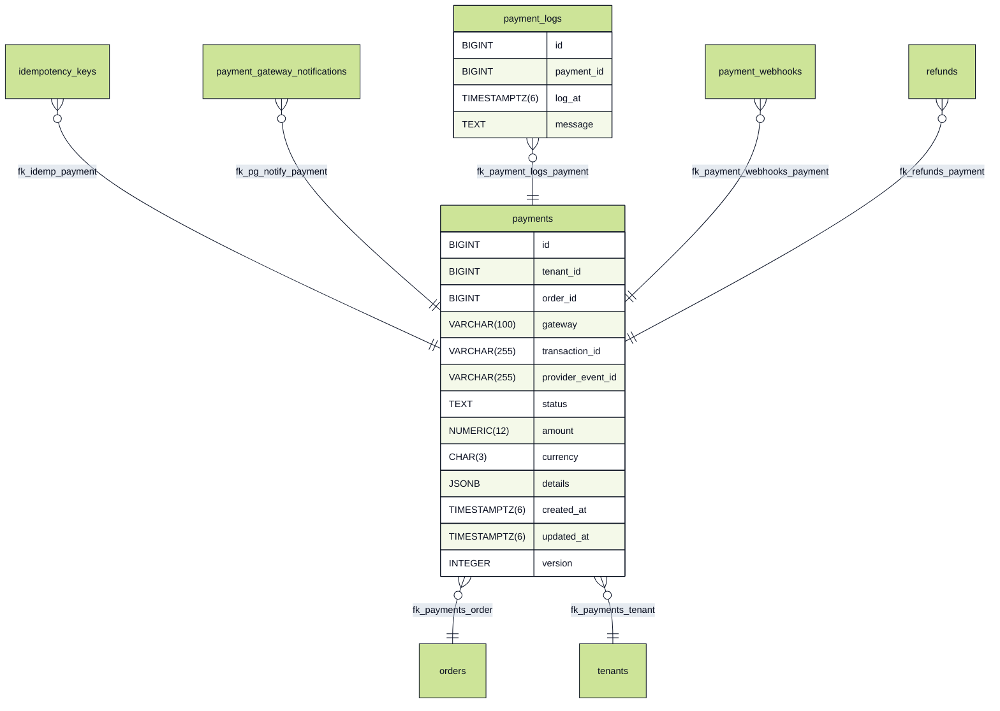

```mermaid
%%{init: {"theme":"forest","themeVariables":{"primaryColor":"#e5e7eb","primaryBorderColor":"#111827","primaryTextColor":"#0b1021","edgeLabelBackground":"#f8fafc","tertiaryColor":"#cbd5e1","tertiaryTextColor":"#0f172a","lineColor":"#0f172a","nodeBorder":"#111827","textColor":"#0b1021","fontSize":"14px"}} }%%
%% Detail ERD for payment_logs (engine: postgres, neighbors: 1)
erDiagram
  direction TB
  payment_logs {
    BIGINT id
    BIGINT payment_id
    TIMESTAMPTZ(6) log_at
    TEXT message
  }
  payments {
    BIGINT id
    BIGINT tenant_id
    BIGINT order_id
    VARCHAR(100) gateway
    VARCHAR(255) transaction_id
    VARCHAR(255) provider_event_id
    TEXT status
    NUMERIC(12) amount
    CHAR(3) currency
    JSONB details
    TIMESTAMPTZ(6) created_at
    TIMESTAMPTZ(6) updated_at
    INTEGER version
  }
idempotency_keys }o--|| payments : fk_idemp_payment
payment_gateway_notifications }o--|| payments : fk_pg_notify_payment
payment_logs }o--|| payments : fk_payment_logs_payment
payment_webhooks }o--|| payments : fk_payment_webhooks_payment
payments }o--|| orders : fk_payments_order
payments }o--|| tenants : fk_payments_tenant
refunds }o--|| payments : fk_refunds_payment
```
