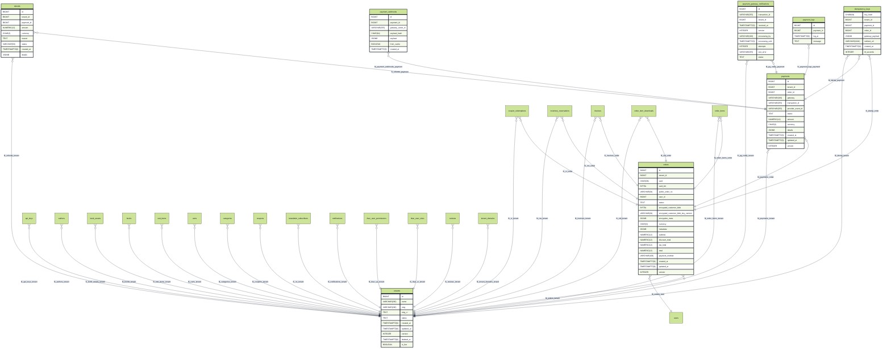

```mermaid
%%{init: {"theme":"forest","themeVariables":{"primaryColor":"#e5e7eb","primaryBorderColor":"#111827","primaryTextColor":"#0b1021","edgeLabelBackground":"#f8fafc","tertiaryColor":"#cbd5e1","tertiaryTextColor":"#0f172a","lineColor":"#0f172a","nodeBorder":"#111827","textColor":"#0b1021","fontSize":"14px"}} }%%
%% Detail ERD for payments (engine: postgres, neighbors: 7)
erDiagram
  direction TB
  payments {
    BIGINT id
    BIGINT tenant_id
    BIGINT order_id
    VARCHAR(100) gateway
    VARCHAR(255) transaction_id
    VARCHAR(255) provider_event_id
    TEXT status
    NUMERIC(12) amount
    CHAR(3) currency
    JSONB details
    TIMESTAMPTZ(6) created_at
    TIMESTAMPTZ(6) updated_at
    INTEGER version
  }
  idempotency_keys {
    CHAR(64) key_hash
    BIGINT tenant_id
    BIGINT payment_id
    BIGINT order_id
    JSONB gateway_payload
    VARCHAR(1024) redirect_url
    TIMESTAMPTZ(6) created_at
    INTEGER ttl_seconds
  }
  orders {
    BIGINT id
    BIGINT tenant_id
    CHAR(36) uuid
    BYTEA uuid_bin
    VARCHAR(64) public_order_no
    BIGINT user_id
    TEXT status
    BYTEA encrypted_customer_blob
    VARCHAR(64) encrypted_customer_blob_key_version
    JSONB encryption_meta
    CHAR(3) currency
    JSONB metadata
    NUMERIC(12) subtotal
    NUMERIC(12) discount_total
    NUMERIC(12) tax_total
    NUMERIC(12) total
    VARCHAR(100) payment_method
    TIMESTAMPTZ(6) created_at
    TIMESTAMPTZ(6) updated_at
    INTEGER version
  }
  payment_gateway_notifications {
    BIGINT id
    VARCHAR(255) transaction_id
    BIGINT tenant_id
    TIMESTAMPTZ(6) received_at
    INTEGER version
    VARCHAR(100) processing_by
    TIMESTAMPTZ(6) processing_until
    INTEGER attempts
    VARCHAR(255) last_error
    TEXT status
  }
  payment_logs {
    BIGINT id
    BIGINT payment_id
    TIMESTAMPTZ(6) log_at
    TEXT message
  }
  payment_webhooks {
    BIGINT id
    BIGINT payment_id
    VARCHAR(255) gateway_event_id
    CHAR(64) payload_hash
    JSONB payload
    BOOLEAN from_cache
    TIMESTAMPTZ(6) created_at
  }
  refunds {
    BIGINT id
    BIGINT tenant_id
    BIGINT payment_id
    NUMERIC(12) amount
    CHAR(3) currency
    TEXT reason
    VARCHAR(50) status
    TIMESTAMPTZ(6) created_at
    JSONB details
  }
  tenants {
    BIGINT id
    VARCHAR(200) name
    VARCHAR(200) slug
    TEXT slug_ci
    TEXT status
    TIMESTAMPTZ(6) created_at
    TIMESTAMPTZ(6) updated_at
    INTEGER version
    TIMESTAMPTZ(6) deleted_at
    BOOLEAN is_live
  }
api_keys }o--|| tenants : fk_api_keys_tenant
authors }o--|| tenants : fk_authors_tenant
book_assets }o--|| tenants : fk_book_assets_tenant
books }o--|| tenants : fk_books_tenant
cart_items }o--|| tenants : fk_cart_items_tenant
carts }o--|| tenants : fk_carts_tenant
categories }o--|| tenants : fk_categories_tenant
coupon_redemptions }o--|| orders : fk_cr_order
coupon_redemptions }o--|| tenants : fk_cr_tenant
coupons }o--|| tenants : fk_coupons_tenant
idempotency_keys }o--|| orders : fk_idemp_order
idempotency_keys }o--|| payments : fk_idemp_payment
idempotency_keys }o--|| tenants : fk_idemp_tenant
inventory_reservations }o--|| orders : fk_res_order
inventory_reservations }o--|| tenants : fk_res_tenant
invoices }o--|| orders : fk_invoices_order
invoices }o--|| tenants : fk_invoices_tenant
newsletter_subscribers }o--|| tenants : fk_ns_tenant
notifications }o--|| tenants : fk_notifications_tenant
order_item_downloads }o--|| orders : fk_oid_order
order_item_downloads }o--|| tenants : fk_oid_tenant
order_items }o--|| orders : fk_order_items_order
order_items }o--|| tenants : fk_order_items_tenant
orders }o--|| tenants : fk_orders_tenant
orders }o--|| users : fk_orders_user
payment_gateway_notifications }o--|| payments : fk_pg_notify_payment
payment_gateway_notifications }o--|| tenants : fk_pg_notify_tenant
payment_logs }o--|| payments : fk_payment_logs_payment
payment_webhooks }o--|| payments : fk_payment_webhooks_payment
payments }o--|| orders : fk_payments_order
payments }o--|| tenants : fk_payments_tenant
rbac_user_permissions }o--|| tenants : fk_rbac_up_tenant
rbac_user_roles }o--|| tenants : fk_rbac_ur_tenant
refunds }o--|| payments : fk_refunds_payment
refunds }o--|| tenants : fk_refunds_tenant
reviews }o--|| tenants : fk_reviews_tenant
tenant_domains }o--|| tenants : fk_tenant_domains_tenant
```
