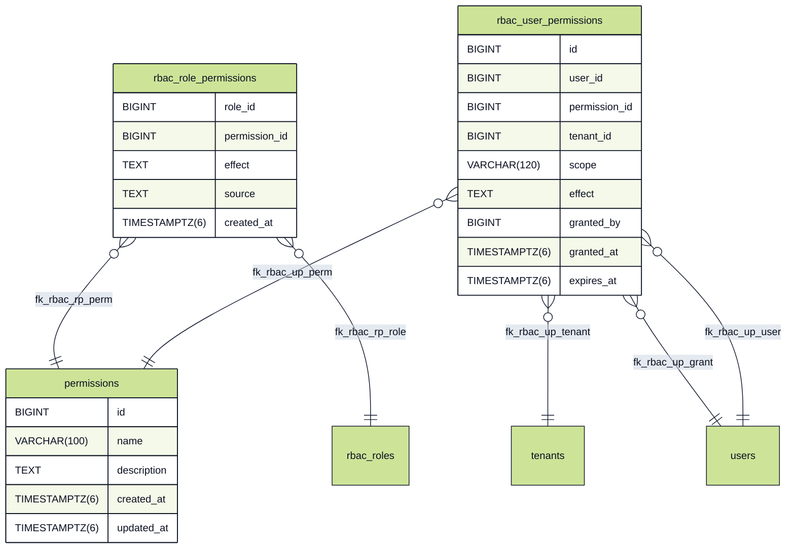

```mermaid
%%{init: {"theme":"forest","themeVariables":{"primaryColor":"#e5e7eb","primaryBorderColor":"#111827","primaryTextColor":"#0b1021","edgeLabelBackground":"#f8fafc","tertiaryColor":"#cbd5e1","tertiaryTextColor":"#0f172a","lineColor":"#0f172a","nodeBorder":"#111827","textColor":"#0b1021","fontSize":"14px"}} }%%
%% Detail ERD for permissions (engine: postgres, neighbors: 2)
erDiagram
  direction TB
  permissions {
    BIGINT id
    VARCHAR(100) name
    TEXT description
    TIMESTAMPTZ(6) created_at
    TIMESTAMPTZ(6) updated_at
  }
  rbac_role_permissions {
    BIGINT role_id
    BIGINT permission_id
    TEXT effect
    TEXT source
    TIMESTAMPTZ(6) created_at
  }
  rbac_user_permissions {
    BIGINT id
    BIGINT user_id
    BIGINT permission_id
    BIGINT tenant_id
    VARCHAR(120) scope
    TEXT effect
    BIGINT granted_by
    TIMESTAMPTZ(6) granted_at
    TIMESTAMPTZ(6) expires_at
  }
rbac_role_permissions }o--|| permissions : fk_rbac_rp_perm
rbac_role_permissions }o--|| rbac_roles : fk_rbac_rp_role
rbac_user_permissions }o--|| permissions : fk_rbac_up_perm
rbac_user_permissions }o--|| tenants : fk_rbac_up_tenant
rbac_user_permissions }o--|| users : fk_rbac_up_grant
rbac_user_permissions }o--|| users : fk_rbac_up_user
```
