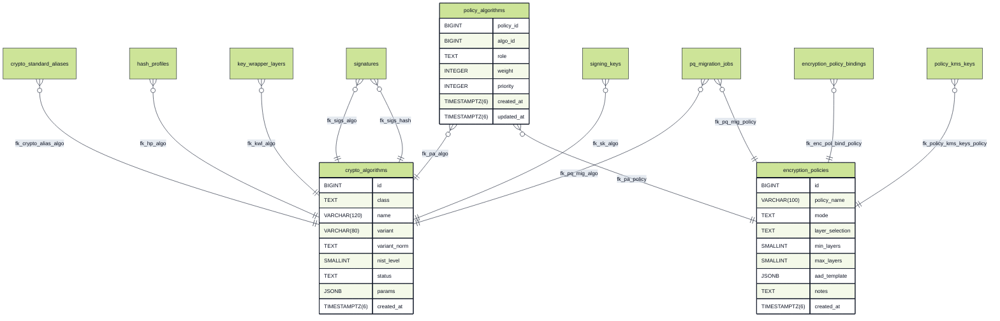

```mermaid
%%{init: {"theme":"forest","themeVariables":{"primaryColor":"#e5e7eb","primaryBorderColor":"#111827","primaryTextColor":"#0b1021","edgeLabelBackground":"#f8fafc","tertiaryColor":"#cbd5e1","tertiaryTextColor":"#0f172a","lineColor":"#0f172a","nodeBorder":"#111827","textColor":"#0b1021","fontSize":"14px"}} }%%
%% Detail ERD for policy_algorithms (engine: postgres, neighbors: 2)
erDiagram
  direction TB
  policy_algorithms {
    BIGINT policy_id
    BIGINT algo_id
    TEXT role
    INTEGER weight
    INTEGER priority
    TIMESTAMPTZ(6) created_at
    TIMESTAMPTZ(6) updated_at
  }
  crypto_algorithms {
    BIGINT id
    TEXT class
    VARCHAR(120) name
    VARCHAR(80) variant
    TEXT variant_norm
    SMALLINT nist_level
    TEXT status
    JSONB params
    TIMESTAMPTZ(6) created_at
  }
  encryption_policies {
    BIGINT id
    VARCHAR(100) policy_name
    TEXT mode
    TEXT layer_selection
    SMALLINT min_layers
    SMALLINT max_layers
    JSONB aad_template
    TEXT notes
    TIMESTAMPTZ(6) created_at
  }
crypto_standard_aliases }o--|| crypto_algorithms : fk_crypto_alias_algo
encryption_policy_bindings }o--|| encryption_policies : fk_enc_pol_bind_policy
hash_profiles }o--|| crypto_algorithms : fk_hp_algo
key_wrapper_layers }o--|| crypto_algorithms : fk_kwl_algo
policy_algorithms }o--|| crypto_algorithms : fk_pa_algo
policy_algorithms }o--|| encryption_policies : fk_pa_policy
policy_kms_keys }o--|| encryption_policies : fk_policy_kms_keys_policy
pq_migration_jobs }o--|| crypto_algorithms : fk_pq_mig_algo
pq_migration_jobs }o--|| encryption_policies : fk_pq_mig_policy
signatures }o--|| crypto_algorithms : fk_sigs_algo
signatures }o--|| crypto_algorithms : fk_sigs_hash
signing_keys }o--|| crypto_algorithms : fk_sk_algo
```
