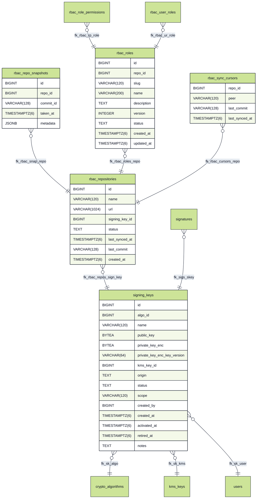

```mermaid
%%{init: {"theme":"forest","themeVariables":{"primaryColor":"#e5e7eb","primaryBorderColor":"#111827","primaryTextColor":"#0b1021","edgeLabelBackground":"#f8fafc","tertiaryColor":"#cbd5e1","tertiaryTextColor":"#0f172a","lineColor":"#0f172a","nodeBorder":"#111827","textColor":"#0b1021","fontSize":"14px"}} }%%
%% Detail ERD for rbac_repositories (engine: postgres, neighbors: 4)
erDiagram
  direction TB
  rbac_repositories {
    BIGINT id
    VARCHAR(120) name
    VARCHAR(1024) url
    BIGINT signing_key_id
    TEXT status
    TIMESTAMPTZ(6) last_synced_at
    VARCHAR(128) last_commit
    TIMESTAMPTZ(6) created_at
  }
  rbac_repo_snapshots {
    BIGINT id
    BIGINT repo_id
    VARCHAR(128) commit_id
    TIMESTAMPTZ(6) taken_at
    JSONB metadata
  }
  rbac_roles {
    BIGINT id
    BIGINT repo_id
    VARCHAR(120) slug
    VARCHAR(200) name
    TEXT description
    INTEGER version
    TEXT status
    TIMESTAMPTZ(6) created_at
    TIMESTAMPTZ(6) updated_at
  }
  rbac_sync_cursors {
    BIGINT repo_id
    VARCHAR(120) peer
    VARCHAR(128) last_commit
    TIMESTAMPTZ(6) last_synced_at
  }
  signing_keys {
    BIGINT id
    BIGINT algo_id
    VARCHAR(120) name
    BYTEA public_key
    BYTEA private_key_enc
    VARCHAR(64) private_key_enc_key_version
    BIGINT kms_key_id
    TEXT origin
    TEXT status
    VARCHAR(120) scope
    BIGINT created_by
    TIMESTAMPTZ(6) created_at
    TIMESTAMPTZ(6) activated_at
    TIMESTAMPTZ(6) retired_at
    TEXT notes
  }
rbac_repo_snapshots }o--|| rbac_repositories : fk_rbac_snap_repo
rbac_repositories }o--|| signing_keys : fk_rbac_repos_sign_key
rbac_role_permissions }o--|| rbac_roles : fk_rbac_rp_role
rbac_roles }o--|| rbac_repositories : fk_rbac_roles_repo
rbac_sync_cursors }o--|| rbac_repositories : fk_rbac_cursors_repo
rbac_user_roles }o--|| rbac_roles : fk_rbac_ur_role
signatures }o--|| signing_keys : fk_sigs_skey
signing_keys }o--|| crypto_algorithms : fk_sk_algo
signing_keys }o--|| kms_keys : fk_sk_kms
signing_keys }o--|| users : fk_sk_user
```
