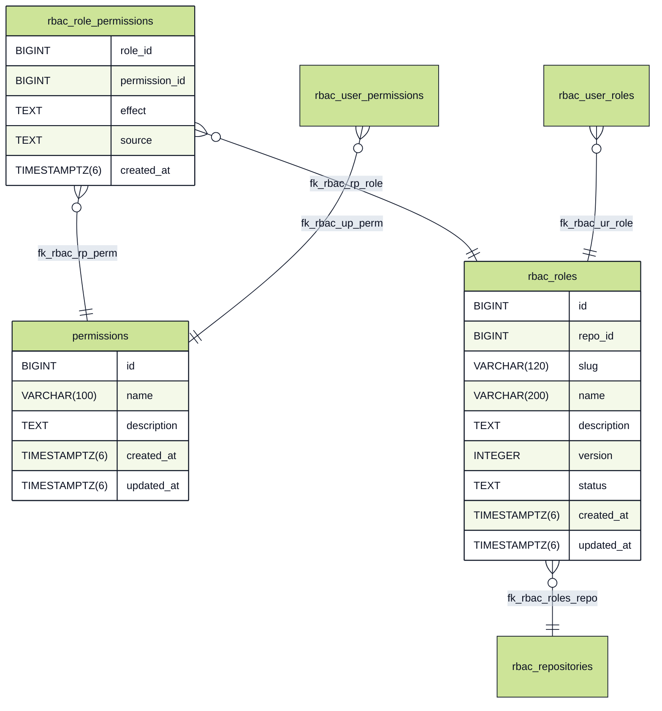

```mermaid
%%{init: {"theme":"forest","themeVariables":{"primaryColor":"#e5e7eb","primaryBorderColor":"#111827","primaryTextColor":"#0b1021","edgeLabelBackground":"#f8fafc","tertiaryColor":"#cbd5e1","tertiaryTextColor":"#0f172a","lineColor":"#0f172a","nodeBorder":"#111827","textColor":"#0b1021","fontSize":"14px"}} }%%
%% Detail ERD for rbac_role_permissions (engine: postgres, neighbors: 2)
erDiagram
  direction TB
  rbac_role_permissions {
    BIGINT role_id
    BIGINT permission_id
    TEXT effect
    TEXT source
    TIMESTAMPTZ(6) created_at
  }
  permissions {
    BIGINT id
    VARCHAR(100) name
    TEXT description
    TIMESTAMPTZ(6) created_at
    TIMESTAMPTZ(6) updated_at
  }
  rbac_roles {
    BIGINT id
    BIGINT repo_id
    VARCHAR(120) slug
    VARCHAR(200) name
    TEXT description
    INTEGER version
    TEXT status
    TIMESTAMPTZ(6) created_at
    TIMESTAMPTZ(6) updated_at
  }
rbac_role_permissions }o--|| permissions : fk_rbac_rp_perm
rbac_role_permissions }o--|| rbac_roles : fk_rbac_rp_role
rbac_roles }o--|| rbac_repositories : fk_rbac_roles_repo
rbac_user_permissions }o--|| permissions : fk_rbac_up_perm
rbac_user_roles }o--|| rbac_roles : fk_rbac_ur_role
```
