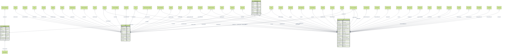

```mermaid
%%{init: {"theme":"forest","themeVariables":{"primaryColor":"#e5e7eb","primaryBorderColor":"#111827","primaryTextColor":"#0b1021","edgeLabelBackground":"#f8fafc","tertiaryColor":"#cbd5e1","tertiaryTextColor":"#0f172a","lineColor":"#0f172a","nodeBorder":"#111827","textColor":"#0b1021","fontSize":"14px"}} }%%
%% Detail ERD for rbac_user_roles (engine: postgres, neighbors: 3)
erDiagram
  direction TB
  rbac_user_roles {
    BIGINT id
    BIGINT user_id
    BIGINT role_id
    BIGINT tenant_id
    VARCHAR(120) scope
    TEXT status
    BIGINT granted_by
    TIMESTAMPTZ(6) granted_at
    TIMESTAMPTZ(6) expires_at
  }
  rbac_roles {
    BIGINT id
    BIGINT repo_id
    VARCHAR(120) slug
    VARCHAR(200) name
    TEXT description
    INTEGER version
    TEXT status
    TIMESTAMPTZ(6) created_at
    TIMESTAMPTZ(6) updated_at
  }
  tenants {
    BIGINT id
    VARCHAR(200) name
    VARCHAR(200) slug
    TEXT slug_ci
    TEXT status
    TIMESTAMPTZ(6) created_at
    TIMESTAMPTZ(6) updated_at
    INTEGER version
    TIMESTAMPTZ(6) deleted_at
    BOOLEAN is_live
  }
  users {
    BIGINT id
    BYTEA email_hash
    VARCHAR(64) email_hash_key_version
    VARCHAR(255) password_hash
    VARCHAR(64) password_algo
    VARCHAR(64) password_key_version
    BOOLEAN is_active
    BOOLEAN is_locked
    INTEGER failed_logins
    BOOLEAN must_change_password
    TIMESTAMPTZ(6) last_login_at
    BYTEA last_login_ip_hash
    VARCHAR(64) last_login_ip_key_version
    TIMESTAMPTZ(6) created_at
    TIMESTAMPTZ(6) updated_at
    INTEGER version
    TIMESTAMPTZ(6) deleted_at
    TEXT actor_role
  }
api_keys }o--|| tenants : fk_api_keys_tenant
api_keys }o--|| users : fk_api_keys_user
app_settings }o--|| users : fk_app_settings_user
audit_log }o--|| users : fk_audit_log_user
auth_events }o--|| users : fk_auth_user
authors }o--|| tenants : fk_authors_tenant
book_assets }o--|| tenants : fk_book_assets_tenant
books }o--|| tenants : fk_books_tenant
cart_items }o--|| tenants : fk_cart_items_tenant
carts }o--|| tenants : fk_carts_tenant
carts }o--|| users : fk_carts_user
categories }o--|| tenants : fk_categories_tenant
coupon_redemptions }o--|| tenants : fk_cr_tenant
coupon_redemptions }o--|| users : fk_cr_user
coupons }o--|| tenants : fk_coupons_tenant
crypto_keys }o--|| users : fk_keys_created_by
deletion_jobs }o--|| users : fk_dj_user
device_fingerprints }o--|| users : fk_df_user
email_verifications }o--|| users : fk_ev_user
idempotency_keys }o--|| tenants : fk_idemp_tenant
inventory_reservations }o--|| tenants : fk_res_tenant
invoices }o--|| tenants : fk_invoices_tenant
jwt_tokens }o--|| users : fk_jwt_tokens_user
key_events }o--|| users : fk_key_events_actor
key_rotation_jobs }o--|| users : fk_key_rotation_jobs_user
login_attempts }o--|| users : fk_login_attempts_user
newsletter_subscribers }o--|| tenants : fk_ns_tenant
newsletter_subscribers }o--|| users : fk_ns_user
notifications }o--|| tenants : fk_notifications_tenant
notifications }o--|| users : fk_notifications_user
order_item_downloads }o--|| tenants : fk_oid_tenant
order_items }o--|| tenants : fk_order_items_tenant
orders }o--|| tenants : fk_orders_tenant
orders }o--|| users : fk_orders_user
payment_gateway_notifications }o--|| tenants : fk_pg_notify_tenant
payments }o--|| tenants : fk_payments_tenant
pq_migration_jobs }o--|| users : fk_pq_mig_user
privacy_requests }o--|| users : fk_pr_user
rbac_role_permissions }o--|| rbac_roles : fk_rbac_rp_role
rbac_roles }o--|| rbac_repositories : fk_rbac_roles_repo
rbac_user_permissions }o--|| tenants : fk_rbac_up_tenant
rbac_user_permissions }o--|| users : fk_rbac_up_grant
rbac_user_permissions }o--|| users : fk_rbac_up_user
rbac_user_roles }o--|| rbac_roles : fk_rbac_ur_role
rbac_user_roles }o--|| tenants : fk_rbac_ur_tenant
rbac_user_roles }o--|| users : fk_rbac_ur_grant
rbac_user_roles }o--|| users : fk_rbac_ur_user
refunds }o--|| tenants : fk_refunds_tenant
register_events }o--|| users : fk_register_user
reviews }o--|| tenants : fk_reviews_tenant
reviews }o--|| users : fk_reviews_user
session_audit }o--|| users : fk_session_audit_user
sessions }o--|| users : fk_sessions_user
signing_keys }o--|| users : fk_sk_user
system_errors }o--|| users : fk_err_resolved_by
system_errors }o--|| users : fk_err_user
tenant_domains }o--|| tenants : fk_tenant_domains_tenant
two_factor }o--|| users : fk_two_factor_user
user_consents }o--|| users : fk_user_consents_user
user_identities }o--|| users : fk_user_identities_user
user_profiles }o--|| users : fk_user_profiles_user
verify_events }o--|| users : fk_verify_user
```
