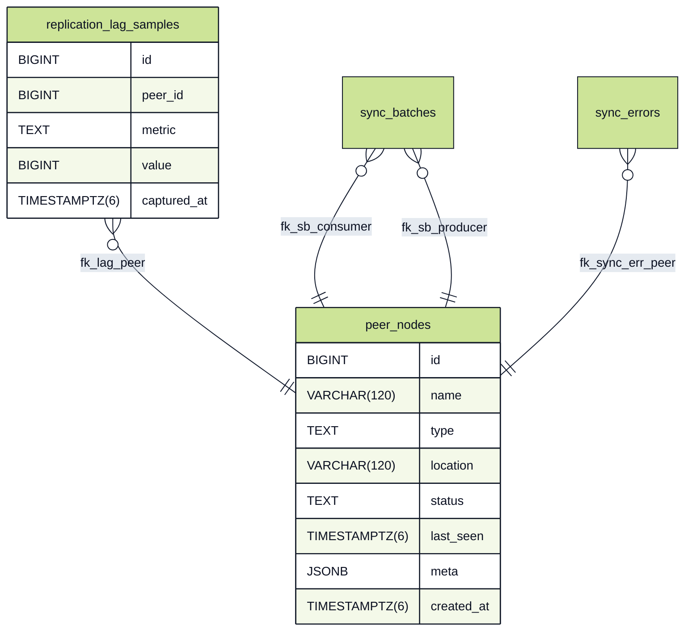

```mermaid
%%{init: {"theme":"forest","themeVariables":{"primaryColor":"#e5e7eb","primaryBorderColor":"#111827","primaryTextColor":"#0b1021","edgeLabelBackground":"#f8fafc","tertiaryColor":"#cbd5e1","tertiaryTextColor":"#0f172a","lineColor":"#0f172a","nodeBorder":"#111827","textColor":"#0b1021","fontSize":"14px"}} }%%
%% Detail ERD for replication_lag_samples (engine: postgres, neighbors: 1)
erDiagram
  direction TB
  replication_lag_samples {
    BIGINT id
    BIGINT peer_id
    TEXT metric
    BIGINT value
    TIMESTAMPTZ(6) captured_at
  }
  peer_nodes {
    BIGINT id
    VARCHAR(120) name
    TEXT type
    VARCHAR(120) location
    TEXT status
    TIMESTAMPTZ(6) last_seen
    JSONB meta
    TIMESTAMPTZ(6) created_at
  }
replication_lag_samples }o--|| peer_nodes : fk_lag_peer
sync_batches }o--|| peer_nodes : fk_sb_consumer
sync_batches }o--|| peer_nodes : fk_sb_producer
sync_errors }o--|| peer_nodes : fk_sync_err_peer
```
