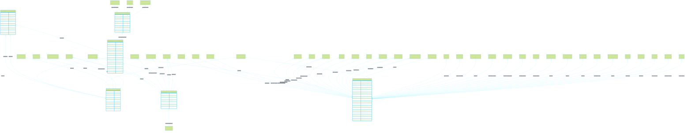

```mermaid
%%{init: {"theme":"forest","themeVariables":{"primaryColor":"#0b1021","primaryBorderColor":"#4ade80","primaryTextColor":"#e2e8f0","edgeLabelBackground":"#0b1021","tertiaryColor":"#111827","tertiaryTextColor":"#cbd5e1","lineColor":"#67e8f9","nodeBorder":"#38bdf8","textColor":"#e2e8f0"}} }%%
%% Detail ERD for signing_keys (engine: postgres, neighbors: 5)
erDiagram
  %% direction: TB
  signing_keys {
    BIGINT id
    BIGINT algo_id
    VARCHAR(120) name
    BYTEA public_key
    BYTEA private_key_enc
    BIGINT kms_key_id
    TEXT origin
    TEXT status
    VARCHAR(120) scope
    BIGINT created_by
    TIMESTAMPTZ(6) created_at
    TIMESTAMPTZ(6) activated_at
    TIMESTAMPTZ(6) retired_at
    TEXT notes
  }
  rbac_repositories {
    BIGINT id
    VARCHAR(120) name
    VARCHAR(1024) url
    BIGINT signing_key_id
    TEXT status
    TIMESTAMPTZ(6) last_synced_at
    VARCHAR(128) last_commit
    TIMESTAMPTZ(6) created_at
  }
  signatures {
    BIGINT id
    VARCHAR(64) subject_table
    VARCHAR(64) subject_pk
    VARCHAR(64) context
    BIGINT algo_id
    BIGINT signing_key_id
    BYTEA signature
    BYTEA payload_hash
    BIGINT hash_algo_id
    TIMESTAMPTZ(6) created_at
  }
  crypto_algorithms {
    BIGINT id
    TEXT class
    VARCHAR(120) name
    VARCHAR(80) variant
    TEXT variant_norm
    SMALLINT nist_level
    TEXT status
    JSONB params
    TIMESTAMPTZ(6) created_at
  }
  kms_keys {
    BIGINT id
    BIGINT provider_id
    VARCHAR(512) external_key_ref
    TEXT purpose
    VARCHAR(64) algorithm
    TEXT status
    TIMESTAMPTZ(6) created_at
  }
  users {
    BIGINT id
    BYTEA email_hash
    VARCHAR(64) email_hash_key_version
    VARCHAR(255) password_hash
    VARCHAR(64) password_algo
    VARCHAR(64) password_key_version
    BOOLEAN is_active
    BOOLEAN is_locked
    INTEGER failed_logins
    BOOLEAN must_change_password
    TIMESTAMPTZ(6) last_login_at
    BYTEA last_login_ip_hash
    VARCHAR(64) last_login_ip_key_version
    TIMESTAMPTZ(6) created_at
    TIMESTAMPTZ(6) updated_at
    INTEGER version
    TIMESTAMPTZ(6) deleted_at
    TEXT actor_role
  }
api_keys }o--|| users : fk_api_keys_user
app_settings }o--|| users : fk_app_settings_user
audit_log }o--|| users : fk_audit_log_user
auth_events }o--|| users : fk_auth_user
carts }o--|| users : fk_carts_user
coupon_redemptions }o--|| users : fk_cr_user
crypto_keys }o--|| users : fk_keys_created_by
crypto_standard_aliases }o--|| crypto_algorithms : fk_crypto_alias_algo
deletion_jobs }o--|| users : fk_dj_user
device_fingerprints }o--|| users : fk_df_user
email_verifications }o--|| users : fk_ev_user
hash_profiles }o--|| crypto_algorithms : fk_hp_algo
jwt_tokens }o--|| users : fk_jwt_tokens_user
key_events }o--|| users : fk_key_events_actor
key_rotation_jobs }o--|| users : fk_key_rotation_jobs_user
key_wrapper_layers }o--|| crypto_algorithms : fk_kwl_algo
key_wrapper_layers }o--|| kms_keys : fk_kwl_kms
key_wrappers }o--|| kms_keys : fk_kw_kms1
key_wrappers }o--|| kms_keys : fk_kw_kms2
kms_health_checks }o--|| kms_keys : fk_kms_hc_key
kms_keys }o--|| kms_providers : fk_kms_keys_provider
login_attempts }o--|| users : fk_login_attempts_user
newsletter_subscribers }o--|| users : fk_ns_user
notifications }o--|| users : fk_notifications_user
orders }o--|| users : fk_orders_user
policy_algorithms }o--|| crypto_algorithms : fk_pa_algo
policy_kms_keys }o--|| kms_keys : fk_policy_kms_keys_key
pq_migration_jobs }o--|| crypto_algorithms : fk_pq_mig_algo
pq_migration_jobs }o--|| users : fk_pq_mig_user
privacy_requests }o--|| users : fk_pr_user
rbac_repo_snapshots }o--|| rbac_repositories : fk_rbac_snap_repo
rbac_repositories }o--|| signing_keys : fk_rbac_repos_sign_key
rbac_roles }o--|| rbac_repositories : fk_rbac_roles_repo
rbac_sync_cursors }o--|| rbac_repositories : fk_rbac_cursors_repo
rbac_user_permissions }o--|| users : fk_rbac_up_grant
rbac_user_permissions }o--|| users : fk_rbac_up_user
rbac_user_roles }o--|| users : fk_rbac_ur_grant
rbac_user_roles }o--|| users : fk_rbac_ur_user
register_events }o--|| users : fk_register_user
reviews }o--|| users : fk_reviews_user
rewrap_jobs }o--|| kms_keys : fk_rewrap_tk1
rewrap_jobs }o--|| kms_keys : fk_rewrap_tk2
session_audit }o--|| users : fk_session_audit_user
sessions }o--|| users : fk_sessions_user
signatures }o--|| crypto_algorithms : fk_sigs_algo
signatures }o--|| crypto_algorithms : fk_sigs_hash
signatures }o--|| signing_keys : fk_sigs_skey
signing_keys }o--|| crypto_algorithms : fk_sk_algo
signing_keys }o--|| kms_keys : fk_sk_kms
signing_keys }o--|| users : fk_sk_user
system_errors }o--|| users : fk_err_resolved_by
system_errors }o--|| users : fk_err_user
two_factor }o--|| users : fk_two_factor_user
user_consents }o--|| users : fk_user_consents_user
user_identities }o--|| users : fk_user_identities_user
user_profiles }o--|| users : fk_user_profiles_user
verify_events }o--|| users : fk_verify_user
```
