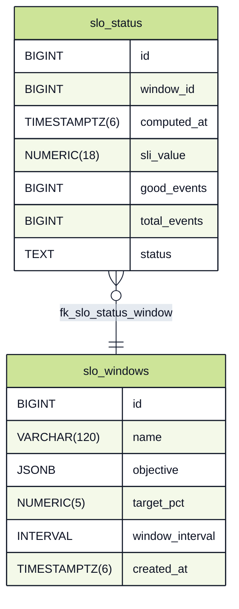

```mermaid
%%{init: {"theme":"forest","themeVariables":{"primaryColor":"#e5e7eb","primaryBorderColor":"#111827","primaryTextColor":"#0b1021","edgeLabelBackground":"#f8fafc","tertiaryColor":"#cbd5e1","tertiaryTextColor":"#0f172a","lineColor":"#0f172a","nodeBorder":"#111827","textColor":"#0b1021","fontSize":"14px"}} }%%
%% Detail ERD for slo_windows (engine: postgres, neighbors: 1)
erDiagram
  direction TB
  slo_windows {
    BIGINT id
    VARCHAR(120) name
    JSONB objective
    NUMERIC(5) target_pct
    INTERVAL window_interval
    TIMESTAMPTZ(6) created_at
  }
  slo_status {
    BIGINT id
    BIGINT window_id
    TIMESTAMPTZ(6) computed_at
    NUMERIC(18) sli_value
    BIGINT good_events
    BIGINT total_events
    TEXT status
  }
slo_status }o--|| slo_windows : fk_slo_status_window
```
