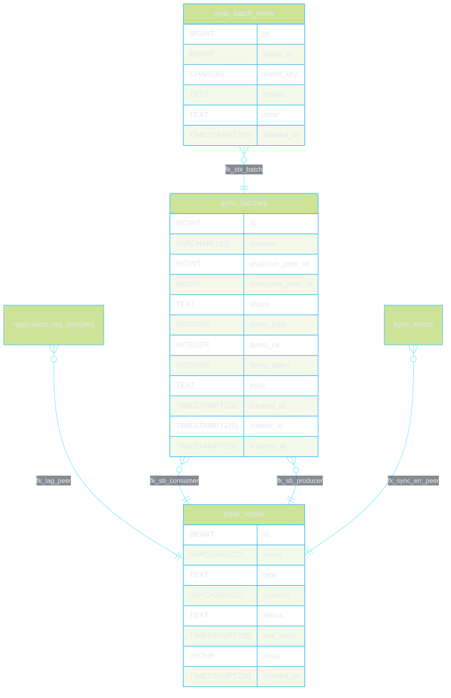

```mermaid
%%{init: {"theme":"forest","themeVariables":{"primaryColor":"#0b1021","primaryBorderColor":"#4ade80","primaryTextColor":"#e2e8f0","edgeLabelBackground":"#0b1021","tertiaryColor":"#111827","tertiaryTextColor":"#cbd5e1","lineColor":"#67e8f9","nodeBorder":"#38bdf8","textColor":"#e2e8f0"}} }%%
%% Detail ERD for sync_batches (engine: postgres, neighbors: 2)
erDiagram
  %% direction: TB
  sync_batches {
    BIGINT id
    VARCHAR(120) channel
    BIGINT producer_peer_id
    BIGINT consumer_peer_id
    TEXT status
    INTEGER items_total
    INTEGER items_ok
    INTEGER items_failed
    TEXT error
    TIMESTAMPTZ(6) created_at
    TIMESTAMPTZ(6) started_at
    TIMESTAMPTZ(6) finished_at
  }
  sync_batch_items {
    BIGINT id
    BIGINT batch_id
    CHAR(36) event_key
    TEXT status
    TEXT error
    TIMESTAMPTZ(6) created_at
  }
  peer_nodes {
    BIGINT id
    VARCHAR(120) name
    TEXT type
    VARCHAR(120) location
    TEXT status
    TIMESTAMPTZ(6) last_seen
    JSONB meta
    TIMESTAMPTZ(6) created_at
  }
replication_lag_samples }o--|| peer_nodes : fk_lag_peer
sync_batch_items }o--|| sync_batches : fk_sbi_batch
sync_batches }o--|| peer_nodes : fk_sb_consumer
sync_batches }o--|| peer_nodes : fk_sb_producer
sync_errors }o--|| peer_nodes : fk_sync_err_peer
```
