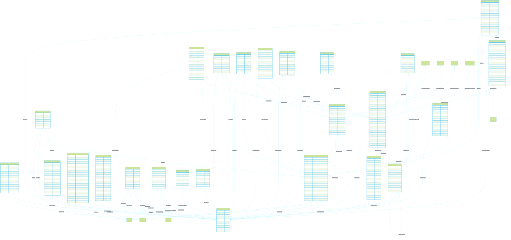

```mermaid
%%{init: {"theme":"forest","themeVariables":{"primaryColor":"#0b1021","primaryBorderColor":"#4ade80","primaryTextColor":"#e2e8f0","edgeLabelBackground":"#0b1021","tertiaryColor":"#111827","tertiaryTextColor":"#cbd5e1","lineColor":"#67e8f9","nodeBorder":"#38bdf8","textColor":"#e2e8f0"}} }%%
%% Detail ERD for tenants (engine: postgres, neighbors: 24)
erDiagram
  %% direction: TB
  tenants {
    BIGINT id
    VARCHAR(200) name
    VARCHAR(200) slug
    TEXT slug_ci
    TEXT status
    TIMESTAMPTZ(6) created_at
    TIMESTAMPTZ(6) updated_at
    INTEGER version
    TIMESTAMPTZ(6) deleted_at
    BOOLEAN is_live
  }
  api_keys {
    BIGSERIAL id
    BIGINT tenant_id
    BIGINT user_id
    VARCHAR(120) name
    TEXT name_ci
    BYTEA token_hash
    VARCHAR(64) token_hash_key_version
    JSONB scopes
    VARCHAR(20) status
    TIMESTAMPTZ(6) last_used_at
    TIMESTAMPTZ(6) expires_at
    TIMESTAMPTZ(6) created_at
    TIMESTAMPTZ(6) updated_at
  }
  authors {
    BIGINT id
    BIGINT tenant_id
    VARCHAR(255) name
    TEXT name_ci
    VARCHAR(255) slug
    TEXT slug_ci
    TEXT bio
    VARCHAR(255) photo_url
    TEXT story
    INTEGER books_count
    INTEGER ratings_count
    INTEGER rating_sum
    NUMERIC(3) avg_rating
    TIMESTAMPTZ(6) last_rating_at
    TIMESTAMPTZ(6) created_at
    TIMESTAMPTZ(6) updated_at
    INTEGER version
    TIMESTAMPTZ(6) deleted_at
    BOOLEAN is_live
  }
  book_assets {
    BIGINT id
    BIGINT tenant_id
    BIGINT book_id
    TEXT asset_type
    VARCHAR(255) filename
    VARCHAR(100) mime_type
    BIGINT size_bytes
    TEXT storage_path
    VARCHAR(64) content_hash
    VARCHAR(255) download_filename
    BOOLEAN is_encrypted
    VARCHAR(50) encryption_algo
    BYTEA encryption_key_enc
    BYTEA encryption_iv
    BYTEA encryption_tag
    BYTEA encryption_aad
    JSONB encryption_meta
    VARCHAR(64) key_version
    BIGINT key_id
    TIMESTAMPTZ(6) created_at
  }
  books {
    BIGINT id
    BIGINT tenant_id
    VARCHAR(255) title
    VARCHAR(255) slug
    TEXT slug_ci
    VARCHAR(512) short_description
    TEXT full_description
    NUMERIC(12) price
    CHAR(3) currency
    BIGINT author_id
    BIGINT main_category_id
    VARCHAR(32) isbn
    CHAR(5) language
    INTEGER pages
    VARCHAR(255) publisher
    DATE published_at
    VARCHAR(64) sku
    BOOLEAN is_active
    BOOLEAN is_available
    INTEGER stock_quantity
    TIMESTAMPTZ(6) created_at
    TIMESTAMPTZ(6) updated_at
    INTEGER version
    TIMESTAMPTZ(6) deleted_at
    BOOLEAN is_live
  }
  cart_items {
    BIGINT id
    BIGINT tenant_id
    CHAR(36) cart_id
    BIGINT book_id
    VARCHAR(64) sku
    VARCHAR(64) sku_norm
    JSONB variant
    INTEGER quantity
    NUMERIC(12) unit_price
    NUMERIC(12) price_snapshot
    CHAR(3) currency
    JSONB meta
    TIMESTAMPTZ(6) created_at
    TIMESTAMPTZ(6) updated_at
  }
  carts {
    CHAR(36) id
    BIGINT tenant_id
    BIGINT user_id
    VARCHAR(200) note
    TIMESTAMPTZ(6) created_at
    TIMESTAMPTZ(6) updated_at
    INTEGER version
  }
  categories {
    BIGINT id
    BIGINT tenant_id
    VARCHAR(255) name
    TEXT name_ci
    VARCHAR(255) slug
    TEXT slug_ci
    BIGINT parent_id
    TIMESTAMPTZ(6) created_at
    TIMESTAMPTZ(6) updated_at
    INTEGER version
    TIMESTAMPTZ(6) deleted_at
    BOOLEAN is_live
  }
  coupon_redemptions {
    BIGINT id
    BIGINT tenant_id
    BIGINT coupon_id
    BIGINT user_id
    BIGINT order_id
    TIMESTAMPTZ(6) redeemed_at
    NUMERIC(12) amount_applied
  }
  coupons {
    BIGINT id
    BIGINT tenant_id
    VARCHAR(100) code
    TEXT code_ci
    TEXT type
    NUMERIC(12) value
    CHAR(3) currency
    DATE starts_at
    DATE ends_at
    INTEGER max_redemptions
    NUMERIC(12) min_order_amount
    JSONB applies_to
    BOOLEAN is_active
    TIMESTAMPTZ(6) created_at
    TIMESTAMPTZ(6) updated_at
  }
  idempotency_keys {
    CHAR(64) key_hash
    BIGINT tenant_id
    BIGINT payment_id
    BIGINT order_id
    JSONB gateway_payload
    VARCHAR(1024) redirect_url
    TIMESTAMPTZ(6) created_at
    INTEGER ttl_seconds
  }
  inventory_reservations {
    BIGINT id
    BIGINT tenant_id
    BIGINT order_id
    BIGINT book_id
    INTEGER quantity
    TIMESTAMPTZ(6) reserved_until
    TEXT status
    TIMESTAMPTZ(6) created_at
    INTEGER version
  }
  invoices {
    BIGINT id
    BIGINT tenant_id
    BIGINT order_id
    VARCHAR(100) invoice_number
    VARCHAR(50) variable_symbol
    DATE issue_date
    DATE due_date
    NUMERIC(12) subtotal
    NUMERIC(12) discount_total
    NUMERIC(12) tax_total
    NUMERIC(12) total
    CHAR(3) currency
    TEXT qr_data
    TIMESTAMPTZ(6) created_at
  }
  newsletter_subscribers {
    BIGINT id
    BIGINT tenant_id
    BIGINT user_id
    BYTEA email_hash
    VARCHAR(64) email_hash_key_version
    BYTEA email_enc
    VARCHAR(64) email_key_version
    CHAR(12) confirm_selector
    BYTEA confirm_validator_hash
    VARCHAR(64) confirm_key_version
    TIMESTAMPTZ(6) confirm_expires
    TIMESTAMPTZ(6) confirmed_at
    BYTEA unsubscribe_token_hash
    VARCHAR(64) unsubscribe_token_key_version
    TIMESTAMPTZ(6) unsubscribed_at
    VARCHAR(100) origin
    BYTEA ip_hash
    VARCHAR(64) ip_hash_key_version
    JSONB meta
    TIMESTAMPTZ(6) created_at
    TIMESTAMPTZ(6) updated_at
    INTEGER version
  }
  notifications {
    BIGINT id
    BIGINT tenant_id
    BIGINT user_id
    TEXT channel
    VARCHAR(100) template
    JSONB payload
    TEXT status
    INTEGER retries
    INTEGER max_retries
    TIMESTAMPTZ(6) next_attempt_at
    TIMESTAMPTZ(6) scheduled_at
    TIMESTAMPTZ(6) sent_at
    TEXT error
    TIMESTAMPTZ(6) last_attempt_at
    TIMESTAMPTZ(6) locked_until
    VARCHAR(100) locked_by
    INTEGER priority
    TIMESTAMPTZ(6) created_at
    TIMESTAMPTZ(6) updated_at
    INTEGER version
  }
  order_item_downloads {
    BIGINT id
    BIGINT tenant_id
    BIGINT order_id
    BIGINT book_id
    BIGINT asset_id
    BYTEA download_token_hash
    VARCHAR(64) token_key_version
    VARCHAR(64) key_version
    INTEGER max_uses
    INTEGER used
    BOOLEAN is_active
    TIMESTAMPTZ(6) expires_at
    TIMESTAMPTZ(6) last_used_at
    BYTEA ip_hash
    VARCHAR(64) ip_hash_key_version
  }
  order_items {
    BIGINT id
    BIGINT tenant_id
    BIGINT order_id
    BIGINT book_id
    INTEGER product_ref
    VARCHAR(255) title_snapshot
    VARCHAR(64) sku_snapshot
    NUMERIC(12) unit_price
    INTEGER quantity
    NUMERIC(5) tax_rate
    CHAR(3) currency
    TIMESTAMPTZ(6) created_at
    TIMESTAMPTZ(6) updated_at
  }
  orders {
    BIGINT id
    BIGINT tenant_id
    CHAR(36) uuid
    BYTEA uuid_bin
    VARCHAR(64) public_order_no
    BIGINT user_id
    TEXT status
    BYTEA encrypted_customer_blob
    VARCHAR(64) encrypted_customer_blob_key_version
    JSONB encryption_meta
    CHAR(3) currency
    JSONB metadata
    NUMERIC(12) subtotal
    NUMERIC(12) discount_total
    NUMERIC(12) tax_total
    NUMERIC(12) total
    VARCHAR(100) payment_method
    TIMESTAMPTZ(6) created_at
    TIMESTAMPTZ(6) updated_at
    INTEGER version
  }
  payment_gateway_notifications {
    BIGINT id
    VARCHAR(255) transaction_id
    BIGINT tenant_id
    TIMESTAMPTZ(6) received_at
    INTEGER version
    VARCHAR(100) processing_by
    TIMESTAMPTZ(6) processing_until
    INTEGER attempts
    VARCHAR(255) last_error
    TEXT status
  }
  payments {
    BIGINT id
    BIGINT tenant_id
    BIGINT order_id
    VARCHAR(100) gateway
    VARCHAR(255) transaction_id
    VARCHAR(255) provider_event_id
    TEXT status
    NUMERIC(12) amount
    CHAR(3) currency
    JSONB details
    TIMESTAMPTZ(6) created_at
    TIMESTAMPTZ(6) updated_at
    INTEGER version
  }
  rbac_user_permissions {
    BIGINT id
    BIGINT user_id
    BIGINT permission_id
    BIGINT tenant_id
    VARCHAR(120) scope
    TEXT effect
    BIGINT granted_by
    TIMESTAMPTZ(6) granted_at
    TIMESTAMPTZ(6) expires_at
  }
  rbac_user_roles {
    BIGINT id
    BIGINT user_id
    BIGINT role_id
    BIGINT tenant_id
    VARCHAR(120) scope
    TEXT status
    BIGINT granted_by
    TIMESTAMPTZ(6) granted_at
    TIMESTAMPTZ(6) expires_at
  }
  refunds {
    BIGINT id
    BIGINT tenant_id
    BIGINT payment_id
    NUMERIC(12) amount
    CHAR(3) currency
    TEXT reason
    VARCHAR(50) status
    TIMESTAMPTZ(6) created_at
    JSONB details
  }
  reviews {
    BIGINT id
    BIGINT tenant_id
    BIGINT book_id
    BIGINT user_id
    SMALLINT rating
    TEXT review_text
    TIMESTAMPTZ(6) created_at
    TIMESTAMPTZ(6) updated_at
  }
  tenant_domains {
    BIGINT id
    BIGINT tenant_id
    VARCHAR(255) domain
    TEXT domain_ci
    BOOLEAN is_primary
    TIMESTAMPTZ(6) created_at
  }
api_keys }o--|| tenants : fk_api_keys_tenant
api_keys }o--|| users : fk_api_keys_user
authors }o--|| tenants : fk_authors_tenant
book_assets }o--|| books : fk_book_assets_book
book_assets }o--|| crypto_keys : fk_book_assets_key
book_assets }o--|| tenants : fk_book_assets_tenant
book_categories }o--|| books : fk_book_categories_book
book_categories }o--|| categories : fk_book_categories_category
books }o--|| authors : fk_books_author
books }o--|| categories : fk_books_category
books }o--|| tenants : fk_books_tenant
cart_items }o--|| books : fk_cart_items_book
cart_items }o--|| carts : fk_cart_items_cart
cart_items }o--|| tenants : fk_cart_items_tenant
carts }o--|| tenants : fk_carts_tenant
carts }o--|| users : fk_carts_user
categories }o--|| categories : fk_categories_parent
categories }o--|| tenants : fk_categories_tenant
coupon_redemptions }o--|| coupons : fk_cr_coupon
coupon_redemptions }o--|| orders : fk_cr_order
coupon_redemptions }o--|| tenants : fk_cr_tenant
coupon_redemptions }o--|| users : fk_cr_user
coupons }o--|| tenants : fk_coupons_tenant
idempotency_keys }o--|| orders : fk_idemp_order
idempotency_keys }o--|| payments : fk_idemp_payment
idempotency_keys }o--|| tenants : fk_idemp_tenant
inventory_reservations }o--|| books : fk_res_book
inventory_reservations }o--|| orders : fk_res_order
inventory_reservations }o--|| tenants : fk_res_tenant
invoice_items }o--|| invoices : fk_invoice_items_invoice
invoices }o--|| orders : fk_invoices_order
invoices }o--|| tenants : fk_invoices_tenant
newsletter_subscribers }o--|| tenants : fk_ns_tenant
newsletter_subscribers }o--|| users : fk_ns_user
notifications }o--|| tenants : fk_notifications_tenant
notifications }o--|| users : fk_notifications_user
order_item_downloads }o--|| book_assets : fk_oid_asset
order_item_downloads }o--|| books : fk_oid_book
order_item_downloads }o--|| orders : fk_oid_order
order_item_downloads }o--|| tenants : fk_oid_tenant
order_items }o--|| books : fk_order_items_book
order_items }o--|| orders : fk_order_items_order
order_items }o--|| tenants : fk_order_items_tenant
orders }o--|| tenants : fk_orders_tenant
orders }o--|| users : fk_orders_user
payment_gateway_notifications }o--|| payments : fk_pg_notify_payment
payment_gateway_notifications }o--|| tenants : fk_pg_notify_tenant
payment_logs }o--|| payments : fk_payment_logs_payment
payment_webhooks }o--|| payments : fk_payment_webhooks_payment
payments }o--|| orders : fk_payments_order
payments }o--|| tenants : fk_payments_tenant
rbac_user_permissions }o--|| permissions : fk_rbac_up_perm
rbac_user_permissions }o--|| tenants : fk_rbac_up_tenant
rbac_user_permissions }o--|| users : fk_rbac_up_grant
rbac_user_permissions }o--|| users : fk_rbac_up_user
rbac_user_roles }o--|| rbac_roles : fk_rbac_ur_role
rbac_user_roles }o--|| tenants : fk_rbac_ur_tenant
rbac_user_roles }o--|| users : fk_rbac_ur_grant
rbac_user_roles }o--|| users : fk_rbac_ur_user
refunds }o--|| payments : fk_refunds_payment
refunds }o--|| tenants : fk_refunds_tenant
reviews }o--|| books : fk_reviews_book
reviews }o--|| tenants : fk_reviews_tenant
reviews }o--|| users : fk_reviews_user
tenant_domains }o--|| tenants : fk_tenant_domains_tenant
```
