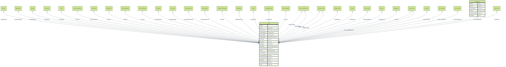

```mermaid
%%{init: {"theme":"forest","themeVariables":{"primaryColor":"#e5e7eb","primaryBorderColor":"#111827","primaryTextColor":"#0b1021","edgeLabelBackground":"#f8fafc","tertiaryColor":"#cbd5e1","tertiaryTextColor":"#0f172a","lineColor":"#0f172a","nodeBorder":"#111827","textColor":"#0b1021","fontSize":"14px"}} }%%
%% Detail ERD for user_profiles (engine: postgres, neighbors: 1)
erDiagram
  direction TB
  user_profiles {
    BIGINT user_id
    BYTEA profile_enc
    VARCHAR(64) key_version
    JSONB encryption_meta
    TIMESTAMPTZ(6) updated_at
    INTEGER version
  }
  users {
    BIGINT id
    BYTEA email_hash
    VARCHAR(64) email_hash_key_version
    VARCHAR(255) password_hash
    VARCHAR(64) password_algo
    VARCHAR(64) password_key_version
    BOOLEAN is_active
    BOOLEAN is_locked
    INTEGER failed_logins
    BOOLEAN must_change_password
    TIMESTAMPTZ(6) last_login_at
    BYTEA last_login_ip_hash
    VARCHAR(64) last_login_ip_key_version
    TIMESTAMPTZ(6) created_at
    TIMESTAMPTZ(6) updated_at
    INTEGER version
    TIMESTAMPTZ(6) deleted_at
    TEXT actor_role
  }
api_keys }o--|| users : fk_api_keys_user
app_settings }o--|| users : fk_app_settings_user
audit_log }o--|| users : fk_audit_log_user
auth_events }o--|| users : fk_auth_user
carts }o--|| users : fk_carts_user
coupon_redemptions }o--|| users : fk_cr_user
crypto_keys }o--|| users : fk_keys_created_by
deletion_jobs }o--|| users : fk_dj_user
device_fingerprints }o--|| users : fk_df_user
email_verifications }o--|| users : fk_ev_user
jwt_tokens }o--|| users : fk_jwt_tokens_user
key_events }o--|| users : fk_key_events_actor
key_rotation_jobs }o--|| users : fk_key_rotation_jobs_user
login_attempts }o--|| users : fk_login_attempts_user
newsletter_subscribers }o--|| users : fk_ns_user
notifications }o--|| users : fk_notifications_user
orders }o--|| users : fk_orders_user
pq_migration_jobs }o--|| users : fk_pq_mig_user
privacy_requests }o--|| users : fk_pr_user
rbac_user_permissions }o--|| users : fk_rbac_up_grant
rbac_user_permissions }o--|| users : fk_rbac_up_user
rbac_user_roles }o--|| users : fk_rbac_ur_grant
rbac_user_roles }o--|| users : fk_rbac_ur_user
register_events }o--|| users : fk_register_user
reviews }o--|| users : fk_reviews_user
session_audit }o--|| users : fk_session_audit_user
sessions }o--|| users : fk_sessions_user
signing_keys }o--|| users : fk_sk_user
system_errors }o--|| users : fk_err_resolved_by
system_errors }o--|| users : fk_err_user
two_factor }o--|| users : fk_two_factor_user
user_consents }o--|| users : fk_user_consents_user
user_identities }o--|| users : fk_user_identities_user
user_profiles }o--|| users : fk_user_profiles_user
verify_events }o--|| users : fk_verify_user
```
