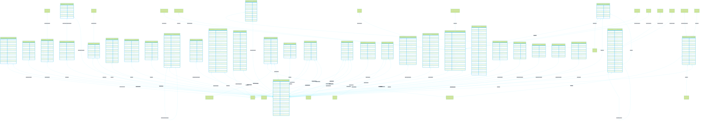

```mermaid
%%{init: {"theme":"forest","themeVariables":{"primaryColor":"#0b1021","primaryBorderColor":"#4ade80","primaryTextColor":"#e2e8f0","edgeLabelBackground":"#0b1021","tertiaryColor":"#111827","tertiaryTextColor":"#cbd5e1","lineColor":"#67e8f9","nodeBorder":"#38bdf8","textColor":"#e2e8f0"}} }%%
%% Detail ERD for users (engine: postgres, neighbors: 32)
erDiagram
  %% direction: TB
  users {
    BIGINT id
    BYTEA email_hash
    VARCHAR(64) email_hash_key_version
    VARCHAR(255) password_hash
    VARCHAR(64) password_algo
    VARCHAR(64) password_key_version
    BOOLEAN is_active
    BOOLEAN is_locked
    INTEGER failed_logins
    BOOLEAN must_change_password
    TIMESTAMPTZ(6) last_login_at
    BYTEA last_login_ip_hash
    VARCHAR(64) last_login_ip_key_version
    TIMESTAMPTZ(6) created_at
    TIMESTAMPTZ(6) updated_at
    INTEGER version
    TIMESTAMPTZ(6) deleted_at
    TEXT actor_role
  }
  api_keys {
    BIGSERIAL id
    BIGINT tenant_id
    BIGINT user_id
    VARCHAR(120) name
    TEXT name_ci
    BYTEA token_hash
    VARCHAR(64) token_hash_key_version
    JSONB scopes
    VARCHAR(20) status
    TIMESTAMPTZ(6) last_used_at
    TIMESTAMPTZ(6) expires_at
    TIMESTAMPTZ(6) created_at
    TIMESTAMPTZ(6) updated_at
  }
  app_settings {
    VARCHAR(100) setting_key
    TEXT setting_value
    TEXT type
    VARCHAR(100) section
    TEXT description
    BOOLEAN is_protected
    TIMESTAMPTZ(6) updated_at
    INTEGER version
    BIGINT updated_by
  }
  audit_log {
    BIGINT id
    VARCHAR(100) table_name
    BIGINT record_id
    BIGINT changed_by
    TEXT change_type
    JSONB old_value
    JSONB new_value
    TIMESTAMPTZ(6) changed_at
    BYTEA ip_bin
    VARCHAR(1024) user_agent
    VARCHAR(100) request_id
  }
  auth_events {
    BIGINT id
    BIGINT user_id
    TEXT type
    BYTEA ip_hash
    VARCHAR(64) ip_hash_key_version
    VARCHAR(1024) user_agent
    TIMESTAMPTZ(6) occurred_at
    JSONB meta
    TEXT meta_email
  }
  carts {
    CHAR(36) id
    BIGINT tenant_id
    BIGINT user_id
    VARCHAR(200) note
    TIMESTAMPTZ(6) created_at
    TIMESTAMPTZ(6) updated_at
    INTEGER version
  }
  coupon_redemptions {
    BIGINT id
    BIGINT tenant_id
    BIGINT coupon_id
    BIGINT user_id
    BIGINT order_id
    TIMESTAMPTZ(6) redeemed_at
    NUMERIC(12) amount_applied
  }
  crypto_keys {
    BIGINT id
    VARCHAR(100) basename
    INTEGER version
    VARCHAR(255) filename
    VARCHAR(1024) file_path
    CHAR(64) fingerprint
    JSONB key_meta
    TEXT key_type
    VARCHAR(64) algorithm
    SMALLINT length_bits
    TEXT origin
    TEXT[] usage
    VARCHAR(100) scope
    TEXT status
    BOOLEAN is_backup_encrypted
    BYTEA backup_blob
    BIGINT created_by
    TIMESTAMPTZ(6) created_at
    TIMESTAMPTZ(6) activated_at
    TIMESTAMPTZ(6) retired_at
    BIGINT replaced_by
    TEXT notes
  }
  deletion_jobs {
    BIGINT id
    VARCHAR(64) entity_table
    VARCHAR(64) entity_pk
    TEXT reason
    BOOLEAN hard_delete
    TIMESTAMPTZ(6) scheduled_at
    TIMESTAMPTZ(6) started_at
    TIMESTAMPTZ(6) finished_at
    TEXT status
    TEXT error
    BIGINT created_by
    TIMESTAMPTZ(6) created_at
  }
  device_fingerprints {
    BIGINT id
    BIGINT user_id
    BYTEA fingerprint_hash
    JSONB attributes
    SMALLINT risk_score
    TIMESTAMPTZ(6) first_seen
    TIMESTAMPTZ(6) last_seen
    BYTEA last_ip_hash
    VARCHAR(64) last_ip_key_version
    TIMESTAMPTZ(6) created_at
    TIMESTAMPTZ(6) updated_at
  }
  email_verifications {
    BIGINT id
    BIGINT user_id
    CHAR(64) token_hash
    CHAR(12) selector
    BYTEA validator_hash
    VARCHAR(64) key_version
    TIMESTAMPTZ(6) expires_at
    TIMESTAMPTZ(6) created_at
    TIMESTAMPTZ(6) used_at
  }
  jwt_tokens {
    BIGINT id
    CHAR(36) jti
    BIGINT user_id
    BYTEA token_hash
    VARCHAR(50) token_hash_algo
    VARCHAR(64) token_hash_key_version
    TEXT type
    VARCHAR(255) scopes
    TIMESTAMPTZ(6) created_at
    INTEGER version
    TIMESTAMPTZ(6) expires_at
    TIMESTAMPTZ(6) last_used_at
    BYTEA ip_hash
    VARCHAR(64) ip_hash_key_version
    BIGINT replaced_by
    BOOLEAN revoked
    JSONB meta
  }
  key_events {
    BIGINT id
    BIGINT key_id
    VARCHAR(100) basename
    TEXT event_type
    BIGINT actor_id
    BIGINT job_id
    TEXT note
    JSONB meta
    TEXT source
    TIMESTAMPTZ(6) created_at
  }
  key_rotation_jobs {
    BIGINT id
    VARCHAR(100) basename
    INTEGER target_version
    TIMESTAMPTZ(6) scheduled_at
    TIMESTAMPTZ(6) started_at
    TIMESTAMPTZ(6) finished_at
    TEXT status
    INTEGER attempts
    BIGINT executed_by
    TEXT result
    TIMESTAMPTZ(6) created_at
  }
  login_attempts {
    BIGINT id
    BYTEA ip_hash
    TIMESTAMPTZ(6) attempted_at
    BOOLEAN success
    BIGINT user_id
    BYTEA username_hash
    BIGINT auth_event_id
  }
  newsletter_subscribers {
    BIGINT id
    BIGINT tenant_id
    BIGINT user_id
    BYTEA email_hash
    VARCHAR(64) email_hash_key_version
    BYTEA email_enc
    VARCHAR(64) email_key_version
    CHAR(12) confirm_selector
    BYTEA confirm_validator_hash
    VARCHAR(64) confirm_key_version
    TIMESTAMPTZ(6) confirm_expires
    TIMESTAMPTZ(6) confirmed_at
    BYTEA unsubscribe_token_hash
    VARCHAR(64) unsubscribe_token_key_version
    TIMESTAMPTZ(6) unsubscribed_at
    VARCHAR(100) origin
    BYTEA ip_hash
    VARCHAR(64) ip_hash_key_version
    JSONB meta
    TIMESTAMPTZ(6) created_at
    TIMESTAMPTZ(6) updated_at
    INTEGER version
  }
  notifications {
    BIGINT id
    BIGINT tenant_id
    BIGINT user_id
    TEXT channel
    VARCHAR(100) template
    JSONB payload
    TEXT status
    INTEGER retries
    INTEGER max_retries
    TIMESTAMPTZ(6) next_attempt_at
    TIMESTAMPTZ(6) scheduled_at
    TIMESTAMPTZ(6) sent_at
    TEXT error
    TIMESTAMPTZ(6) last_attempt_at
    TIMESTAMPTZ(6) locked_until
    VARCHAR(100) locked_by
    INTEGER priority
    TIMESTAMPTZ(6) created_at
    TIMESTAMPTZ(6) updated_at
    INTEGER version
  }
  orders {
    BIGINT id
    BIGINT tenant_id
    CHAR(36) uuid
    BYTEA uuid_bin
    VARCHAR(64) public_order_no
    BIGINT user_id
    TEXT status
    BYTEA encrypted_customer_blob
    VARCHAR(64) encrypted_customer_blob_key_version
    JSONB encryption_meta
    CHAR(3) currency
    JSONB metadata
    NUMERIC(12) subtotal
    NUMERIC(12) discount_total
    NUMERIC(12) tax_total
    NUMERIC(12) total
    VARCHAR(100) payment_method
    TIMESTAMPTZ(6) created_at
    TIMESTAMPTZ(6) updated_at
    INTEGER version
  }
  pq_migration_jobs {
    BIGINT id
    TEXT scope
    BIGINT target_policy_id
    BIGINT target_algo_id
    JSONB selection
    TIMESTAMPTZ(6) scheduled_at
    TIMESTAMPTZ(6) started_at
    TIMESTAMPTZ(6) finished_at
    TEXT status
    BIGINT processed_count
    TEXT error
    BIGINT created_by
    TIMESTAMPTZ(6) created_at
  }
  privacy_requests {
    BIGINT id
    BIGINT user_id
    TEXT type
    TEXT status
    TIMESTAMPTZ(6) requested_at
    TIMESTAMPTZ(6) processed_at
    JSONB meta
  }
  rbac_user_permissions {
    BIGINT id
    BIGINT user_id
    BIGINT permission_id
    BIGINT tenant_id
    VARCHAR(120) scope
    TEXT effect
    BIGINT granted_by
    TIMESTAMPTZ(6) granted_at
    TIMESTAMPTZ(6) expires_at
  }
  rbac_user_roles {
    BIGINT id
    BIGINT user_id
    BIGINT role_id
    BIGINT tenant_id
    VARCHAR(120) scope
    TEXT status
    BIGINT granted_by
    TIMESTAMPTZ(6) granted_at
    TIMESTAMPTZ(6) expires_at
  }
  register_events {
    BIGINT id
    BIGINT user_id
    TEXT type
    BYTEA ip_hash
    VARCHAR(64) ip_hash_key_version
    VARCHAR(1024) user_agent
    TIMESTAMPTZ(6) occurred_at
    JSONB meta
  }
  reviews {
    BIGINT id
    BIGINT tenant_id
    BIGINT book_id
    BIGINT user_id
    SMALLINT rating
    TEXT review_text
    TIMESTAMPTZ(6) created_at
    TIMESTAMPTZ(6) updated_at
  }
  session_audit {
    BIGINT id
    BYTEA session_token_hash
    VARCHAR(64) session_token_key_version
    BYTEA csrf_token_hash
    VARCHAR(64) csrf_key_version
    VARCHAR(128) session_id
    VARCHAR(64) event
    BIGINT user_id
    BYTEA ip_hash
    VARCHAR(64) ip_hash_key_version
    VARCHAR(1024) user_agent
    JSONB meta_json
    VARCHAR(32) outcome
    TIMESTAMPTZ(6) created_at
  }
  sessions {
    BIGINT id
    BYTEA token_hash
    VARCHAR(64) token_hash_key_version
    BYTEA token_fingerprint
    TIMESTAMPTZ(6) token_issued_at
    BIGINT user_id
    TIMESTAMPTZ(6) created_at
    INTEGER version
    TIMESTAMPTZ(6) last_seen_at
    TIMESTAMPTZ(6) expires_at
    INTEGER failed_decrypt_count
    TIMESTAMPTZ(6) last_failed_decrypt_at
    BOOLEAN revoked
    BYTEA ip_hash
    VARCHAR(64) ip_hash_key_version
    VARCHAR(1024) user_agent
    BYTEA session_blob
  }
  signing_keys {
    BIGINT id
    BIGINT algo_id
    VARCHAR(120) name
    BYTEA public_key
    BYTEA private_key_enc
    BIGINT kms_key_id
    TEXT origin
    TEXT status
    VARCHAR(120) scope
    BIGINT created_by
    TIMESTAMPTZ(6) created_at
    TIMESTAMPTZ(6) activated_at
    TIMESTAMPTZ(6) retired_at
    TEXT notes
  }
  system_errors {
    BIGINT id
    TEXT level
    TEXT message
    VARCHAR(255) exception_class
    VARCHAR(1024) file
    INTEGER line
    TEXT stack_trace
    VARCHAR(255) token
    JSONB context
    VARCHAR(64) fingerprint
    INTEGER occurrences
    BIGINT user_id
    BYTEA ip_hash
    VARCHAR(64) ip_hash_key_version
    VARCHAR(45) ip_text
    BYTEA ip_bin
    VARCHAR(1024) user_agent
    VARCHAR(2048) url
    VARCHAR(10) method
    SMALLINT http_status
    BOOLEAN resolved
    BIGINT resolved_by
    TIMESTAMPTZ(6) resolved_at
    TIMESTAMPTZ(6) created_at
    TIMESTAMPTZ(6) last_seen
  }
  two_factor {
    BIGINT user_id
    VARCHAR(50) method
    BYTEA secret
    BYTEA recovery_codes_enc
    BIGINT hotp_counter
    BOOLEAN enabled
    TIMESTAMPTZ(6) created_at
    INTEGER version
    TIMESTAMPTZ(6) last_used_at
  }
  user_consents {
    BIGINT id
    BIGINT user_id
    VARCHAR(50) consent_type
    VARCHAR(50) version
    BOOLEAN granted
    TIMESTAMPTZ(6) granted_at
    VARCHAR(100) source
    JSONB meta
  }
  user_identities {
    BIGINT id
    BIGINT user_id
    VARCHAR(100) provider
    VARCHAR(255) provider_user_id
    TIMESTAMPTZ(6) created_at
    TIMESTAMPTZ(6) updated_at
  }
  user_profiles {
    BIGINT user_id
    BYTEA profile_enc
    VARCHAR(64) key_version
    JSONB encryption_meta
    TIMESTAMPTZ(6) updated_at
    INTEGER version
  }
  verify_events {
    BIGINT id
    BIGINT user_id
    TEXT type
    BYTEA ip_hash
    VARCHAR(64) ip_hash_key_version
    VARCHAR(1024) user_agent
    TIMESTAMPTZ(6) occurred_at
    JSONB meta
  }
api_keys }o--|| tenants : fk_api_keys_tenant
api_keys }o--|| users : fk_api_keys_user
app_settings }o--|| users : fk_app_settings_user
audit_chain }o--|| audit_log : fk_audit_chain_audit
audit_log }o--|| users : fk_audit_log_user
auth_events }o--|| users : fk_auth_user
book_assets }o--|| crypto_keys : fk_book_assets_key
cart_items }o--|| carts : fk_cart_items_cart
carts }o--|| tenants : fk_carts_tenant
carts }o--|| users : fk_carts_user
coupon_redemptions }o--|| coupons : fk_cr_coupon
coupon_redemptions }o--|| orders : fk_cr_order
coupon_redemptions }o--|| tenants : fk_cr_tenant
coupon_redemptions }o--|| users : fk_cr_user
crypto_keys }o--|| crypto_keys : fk_keys_replaced_by
crypto_keys }o--|| users : fk_keys_created_by
deletion_jobs }o--|| users : fk_dj_user
device_fingerprints }o--|| users : fk_df_user
email_verifications }o--|| users : fk_ev_user
idempotency_keys }o--|| orders : fk_idemp_order
inventory_reservations }o--|| orders : fk_res_order
invoices }o--|| orders : fk_invoices_order
jwt_tokens }o--|| jwt_tokens : fk_jwt_tokens_replaced_by
jwt_tokens }o--|| users : fk_jwt_tokens_user
key_events }o--|| crypto_keys : fk_key_events_key
key_events }o--|| users : fk_key_events_actor
key_rotation_jobs }o--|| users : fk_key_rotation_jobs_user
key_usage }o--|| crypto_keys : fk_key_usage_key
login_attempts }o--|| auth_events : fk_login_attempts_auth_event
login_attempts }o--|| users : fk_login_attempts_user
newsletter_subscribers }o--|| tenants : fk_ns_tenant
newsletter_subscribers }o--|| users : fk_ns_user
notifications }o--|| tenants : fk_notifications_tenant
notifications }o--|| users : fk_notifications_user
order_item_downloads }o--|| orders : fk_oid_order
order_items }o--|| orders : fk_order_items_order
orders }o--|| tenants : fk_orders_tenant
orders }o--|| users : fk_orders_user
payments }o--|| orders : fk_payments_order
pq_migration_jobs }o--|| crypto_algorithms : fk_pq_mig_algo
pq_migration_jobs }o--|| encryption_policies : fk_pq_mig_policy
pq_migration_jobs }o--|| users : fk_pq_mig_user
privacy_requests }o--|| users : fk_pr_user
rbac_repositories }o--|| signing_keys : fk_rbac_repos_sign_key
rbac_user_permissions }o--|| permissions : fk_rbac_up_perm
rbac_user_permissions }o--|| tenants : fk_rbac_up_tenant
rbac_user_permissions }o--|| users : fk_rbac_up_grant
rbac_user_permissions }o--|| users : fk_rbac_up_user
rbac_user_roles }o--|| rbac_roles : fk_rbac_ur_role
rbac_user_roles }o--|| tenants : fk_rbac_ur_tenant
rbac_user_roles }o--|| users : fk_rbac_ur_grant
rbac_user_roles }o--|| users : fk_rbac_ur_user
register_events }o--|| users : fk_register_user
reviews }o--|| books : fk_reviews_book
reviews }o--|| tenants : fk_reviews_tenant
reviews }o--|| users : fk_reviews_user
session_audit }o--|| users : fk_session_audit_user
sessions }o--|| users : fk_sessions_user
signatures }o--|| signing_keys : fk_sigs_skey
signing_keys }o--|| crypto_algorithms : fk_sk_algo
signing_keys }o--|| kms_keys : fk_sk_kms
signing_keys }o--|| users : fk_sk_user
system_errors }o--|| users : fk_err_resolved_by
system_errors }o--|| users : fk_err_user
two_factor }o--|| users : fk_two_factor_user
user_consents }o--|| users : fk_user_consents_user
user_identities }o--|| users : fk_user_identities_user
user_profiles }o--|| users : fk_user_profiles_user
verify_events }o--|| users : fk_verify_user
```
