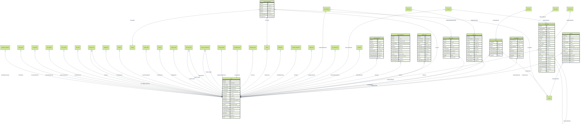

```mermaid
%%{init: {"theme":"forest","themeVariables":{"primaryColor":"#e5e7eb","primaryBorderColor":"#111827","primaryTextColor":"#0b1021","edgeLabelBackground":"#f8fafc","tertiaryColor":"#cbd5e1","tertiaryTextColor":"#0f172a","lineColor":"#0f172a","nodeBorder":"#111827","textColor":"#0b1021","fontSize":"14px"}} }%%
%% Detail ERD for users (engine: postgres, neighbors: 10)
erDiagram
  direction TB
  users {
    BIGINT id
    BYTEA email_hash
    VARCHAR(64) email_hash_key_version
    VARCHAR(255) password_hash
    VARCHAR(64) password_algo
    VARCHAR(64) password_key_version
    BOOLEAN is_active
    BOOLEAN is_locked
    INTEGER failed_logins
    BOOLEAN must_change_password
    TIMESTAMPTZ(6) last_login_at
    BYTEA last_login_ip_hash
    VARCHAR(64) last_login_ip_key_version
    TIMESTAMPTZ(6) created_at
    TIMESTAMPTZ(6) updated_at
    INTEGER version
    TIMESTAMPTZ(6) deleted_at
    TEXT actor_role
  }
  api_keys {
    BIGSERIAL id
    BIGINT tenant_id
    BIGINT user_id
    VARCHAR(120) name
    TEXT name_ci
    BYTEA token_hash
    VARCHAR(64) token_hash_key_version
    JSONB scopes
    VARCHAR(20) status
    TIMESTAMPTZ(6) last_used_at
    TIMESTAMPTZ(6) expires_at
    TIMESTAMPTZ(6) created_at
    TIMESTAMPTZ(6) updated_at
  }
  app_settings {
    VARCHAR(100) setting_key
    TEXT setting_value
    TEXT type
    VARCHAR(100) section
    TEXT description
    BOOLEAN is_protected
    TIMESTAMPTZ(6) updated_at
    INTEGER version
    BIGINT updated_by
  }
  audit_log {
    BIGINT id
    VARCHAR(100) table_name
    BIGINT record_id
    BIGINT changed_by
    TEXT change_type
    JSONB old_value
    JSONB new_value
    TIMESTAMPTZ(6) changed_at
    BYTEA ip_bin
    VARCHAR(64) ip_bin_key_version
    VARCHAR(1024) user_agent
    VARCHAR(100) request_id
  }
  auth_events {
    BIGINT id
    BIGINT user_id
    TEXT type
    BYTEA ip_hash
    VARCHAR(64) ip_hash_key_version
    VARCHAR(1024) user_agent
    TIMESTAMPTZ(6) occurred_at
    JSONB meta
    TEXT meta_email
  }
  carts {
    CHAR(36) id
    BIGINT tenant_id
    BIGINT user_id
    VARCHAR(200) note
    TIMESTAMPTZ(6) created_at
    TIMESTAMPTZ(6) updated_at
    INTEGER version
  }
  coupon_redemptions {
    BIGINT id
    BIGINT tenant_id
    BIGINT coupon_id
    BIGINT user_id
    BIGINT order_id
    TIMESTAMPTZ(6) redeemed_at
    NUMERIC(12) amount_applied
  }
  crypto_keys {
    BIGINT id
    VARCHAR(100) basename
    INTEGER version
    VARCHAR(255) filename
    VARCHAR(1024) file_path
    CHAR(64) fingerprint
    JSONB key_meta
    TEXT key_type
    VARCHAR(64) algorithm
    SMALLINT length_bits
    TEXT origin
    TEXT[] usage
    VARCHAR(100) scope
    TEXT status
    BOOLEAN is_backup_encrypted
    BYTEA backup_blob
    BIGINT created_by
    TIMESTAMPTZ(6) created_at
    TIMESTAMPTZ(6) activated_at
    TIMESTAMPTZ(6) retired_at
    BIGINT replaced_by
    TEXT notes
  }
  deletion_jobs {
    BIGINT id
    VARCHAR(64) entity_table
    VARCHAR(64) entity_pk
    TEXT reason
    BOOLEAN hard_delete
    TIMESTAMPTZ(6) scheduled_at
    TIMESTAMPTZ(6) started_at
    TIMESTAMPTZ(6) finished_at
    TEXT status
    TEXT error
    BIGINT created_by
    TIMESTAMPTZ(6) created_at
  }
  device_fingerprints {
    BIGINT id
    BIGINT user_id
    BYTEA fingerprint_hash
    VARCHAR(64) fingerprint_hash_key_version
    JSONB attributes
    SMALLINT risk_score
    TIMESTAMPTZ(6) first_seen
    TIMESTAMPTZ(6) last_seen
    BYTEA last_ip_hash
    VARCHAR(64) last_ip_key_version
    TIMESTAMPTZ(6) created_at
    TIMESTAMPTZ(6) updated_at
  }
  email_verifications {
    BIGINT id
    BIGINT user_id
    CHAR(64) token_hash
    CHAR(12) selector
    BYTEA validator_hash
    VARCHAR(64) key_version
    TIMESTAMPTZ(6) expires_at
    TIMESTAMPTZ(6) created_at
    TIMESTAMPTZ(6) used_at
  }
api_keys }o--|| tenants : fk_api_keys_tenant
api_keys }o--|| users : fk_api_keys_user
app_settings }o--|| users : fk_app_settings_user
audit_chain }o--|| audit_log : fk_audit_chain_audit
audit_log }o--|| users : fk_audit_log_user
auth_events }o--|| users : fk_auth_user
book_assets }o--|| crypto_keys : fk_book_assets_key
cart_items }o--|| carts : fk_cart_items_cart
carts }o--|| tenants : fk_carts_tenant
carts }o--|| users : fk_carts_user
coupon_redemptions }o--|| coupons : fk_cr_coupon
coupon_redemptions }o--|| orders : fk_cr_order
coupon_redemptions }o--|| tenants : fk_cr_tenant
coupon_redemptions }o--|| users : fk_cr_user
crypto_keys }o--|| crypto_keys : fk_keys_replaced_by
crypto_keys }o--|| users : fk_keys_created_by
deletion_jobs }o--|| users : fk_dj_user
device_fingerprints }o--|| users : fk_df_user
email_verifications }o--|| users : fk_ev_user
jwt_tokens }o--|| users : fk_jwt_tokens_user
key_events }o--|| crypto_keys : fk_key_events_key
key_events }o--|| users : fk_key_events_actor
key_rotation_jobs }o--|| users : fk_key_rotation_jobs_user
key_usage }o--|| crypto_keys : fk_key_usage_key
login_attempts }o--|| auth_events : fk_login_attempts_auth_event
login_attempts }o--|| users : fk_login_attempts_user
magic_links }o--|| users : fk_magic_links_user
newsletter_subscribers }o--|| users : fk_ns_user
notifications }o--|| users : fk_notifications_user
orders }o--|| users : fk_orders_user
password_resets }o--|| users : fk_pr_user
pq_migration_jobs }o--|| users : fk_pq_mig_user
privacy_requests }o--|| users : fk_privacy_requests_user
rbac_user_permissions }o--|| users : fk_rbac_up_grant
rbac_user_permissions }o--|| users : fk_rbac_up_user
rbac_user_roles }o--|| users : fk_rbac_ur_grant
rbac_user_roles }o--|| users : fk_rbac_ur_user
register_events }o--|| users : fk_register_user
reviews }o--|| users : fk_reviews_user
session_audit }o--|| users : fk_session_audit_user
sessions }o--|| users : fk_sessions_user
signing_keys }o--|| users : fk_sk_user
system_errors }o--|| users : fk_err_resolved_by
system_errors }o--|| users : fk_err_user
two_factor }o--|| users : fk_two_factor_user
user_consents }o--|| users : fk_user_consents_user
user_identities }o--|| users : fk_user_identities_user
user_profiles }o--|| users : fk_user_profiles_user
verify_events }o--|| users : fk_verify_user
webauthn_credentials }o--|| users : fk_webauthn_cred_user
```
