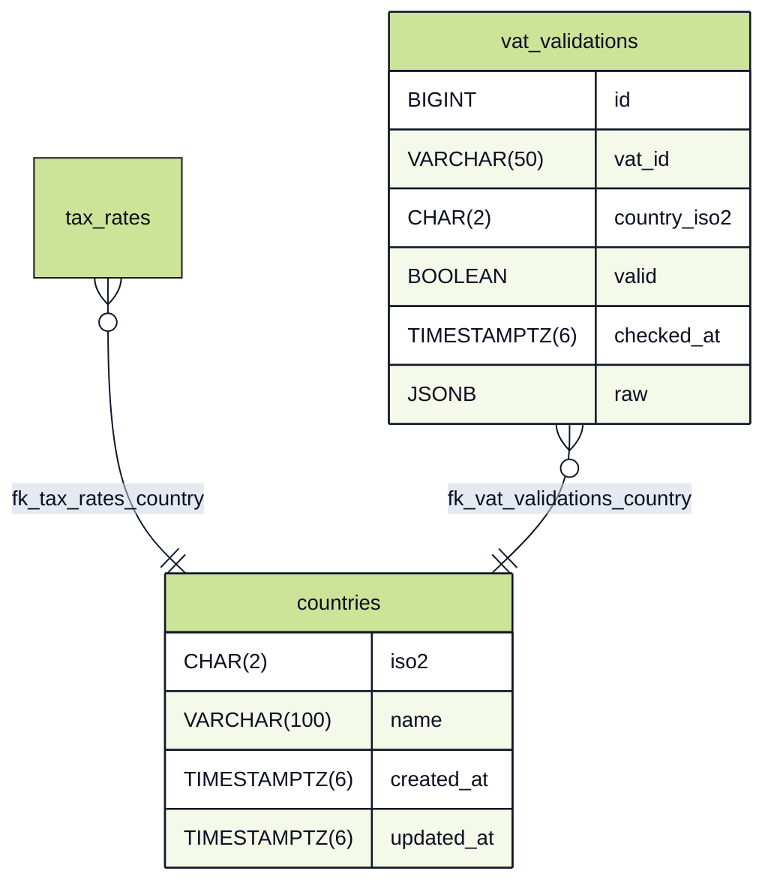

```mermaid
%%{init: {"theme":"forest","themeVariables":{"primaryColor":"#e5e7eb","primaryBorderColor":"#111827","primaryTextColor":"#0b1021","edgeLabelBackground":"#f8fafc","tertiaryColor":"#cbd5e1","tertiaryTextColor":"#0f172a","lineColor":"#0f172a","nodeBorder":"#111827","textColor":"#0b1021","fontSize":"14px"}} }%%
%% Detail ERD for vat_validations (engine: postgres, neighbors: 1)
erDiagram
  direction TB
  vat_validations {
    BIGINT id
    VARCHAR(50) vat_id
    CHAR(2) country_iso2
    BOOLEAN valid
    TIMESTAMPTZ(6) checked_at
    JSONB raw
  }
  countries {
    CHAR(2) iso2
    VARCHAR(100) name
    TIMESTAMPTZ(6) created_at
    TIMESTAMPTZ(6) updated_at
  }
tax_rates }o--|| countries : fk_tax_rates_country
vat_validations }o--|| countries : fk_vat_validations_country
```
